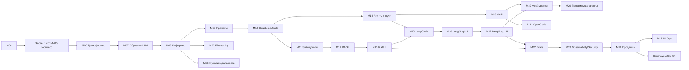

# Курс «AI-инженер: от устройства LLM до мультиагентных систем»

> **План курса.** Версия 2.1 · 25.09.2026 · этап 2 (инфраструктура + M00) выполнен, см. §11
> Изменения относительно v1: убран Python с нуля; классическое ML, PyTorch, CV, NLP и прочие области сжаты в 5 обзорных модулей; основное время отдано устройству LLM, промптам, RAG, LangChain, LangGraph, MCP и агентам; теория переведена на Quarto; учтены твои модели и публичный репозиторий для будущей продажи курса.

---

## Содержание

1. [Коротко о курсе](#1-коротко-о-курсе)
2. [Принципы курса](#2-принципы-курса)
3. [Модели и железо](#3-модели-и-железо)
4. [Формат модуля и урока](#4-формат-модуля-и-урока)
5. [Структура репозитория](#5-структура-репозитория)
6. [Инфраструктура](#6-инфраструктура)
7. [Программа курса](#7-программа-курса)
   - [Часть 0. Старт](#часть-0-старт)
   - [Часть I. Фундамент-экспресс](#часть-i-фундамент-экспресс-сжато)
   - [Часть II. Устройство LLM](#часть-ii-устройство-llm-глубоко)
   - [Часть III. Работа с LLM: промпты, structured output, RAG](#часть-iii-работа-с-llm-промпты-structured-output-rag-глубоко)
   - [Часть IV. Агенты: LangChain, LangGraph, MCP, фреймворки](#часть-iv-агенты-langchain-langgraph-mcp-фреймворки-глубоко)
   - [Часть V. Надёжность: оценка, observability, безопасность](#часть-v-надёжность-оценка-observability-безопасность)
   - [Часть VI. Продакшн и смежные темы](#часть-vi-продакшн-и-смежные-темы-сжато)
8. [Капстоун-проекты](#8-капстоун-проекты)
9. [Маршруты и карта зависимостей](#9-маршруты-и-карта-зависимостей)
10. [Публичный репозиторий и продажа курса](#10-публичный-репозиторий-и-продажа-курса)
11. [Этапы создания курса](#11-этапы-создания-курса)
12. [Принятые решения и открытые вопросы](#12-принятые-решения-и-открытые-вопросы)

---

## 1. Коротко о курсе

| Параметр | Значение |
|---|---|
| Для кого | Python-разработчики уровня middle+ с базовой математикой, которые хотят стать AI/LLM-инженерами |
| Объём | **28 модулей** (M00–M27) в 7 частях + **4 капстоун-проекта** |
| Уроки | **~170 уроков**: ноутбук, код с нуля и через фреймворк, упражнения с автотестами |
| Теория | **28 PDF** + шпаргалки + единая PDF-книга + **сайт курса** (всё из одного источника на Quarto) |
| Трудоёмкость | **~410 часов** ≈ 5–6 месяцев при 15–20 ч/неделю |
| Модели | локальная `qwen3:8b` (Ollama) и любой OpenAI-совместимый endpoint; платные API не нужны |

### Распределение времени

| Блок | Часы | Доля | Глубина |
|---|---|---|---|
| Часть 0. Старт | 4 | 1% | — |
| Часть I. Фундамент-экспресс (математика, классическое ML, PyTorch, CV, NLP, обзор остального ML) | 34 | 8% | 🔹 обзорно |
| Часть II. Устройство LLM | 40 | 10% | 🔷 глубоко |
| Часть III. Промпты, structured output, эмбеддинги, RAG | 64 | 16% | 🔷 глубоко |
| Часть IV. Агенты, LangChain, LangGraph, MCP, фреймворки, OpenCode | 112 | 27% | 🔷 очень глубоко |
| Часть V. Оценка, observability, безопасность | 22 | 5% | 🔷 глубоко |
| Часть VI. Продакшн, fine-tuning, мультимодальность, MLOps | 32 | 8% | 🔹 сжато |
| Капстоуны | ~100 | 25% | проекты |

**Ядро курса (части II–V) занимает ~240 часов, это ~77% учебного времени модулей.**

---

## 2. Принципы курса

1. **«Сначала руками, потом фреймворк».** Tool calling, ReAct-агент, RAG и MCP сначала пишем с нуля на чистом Python, потом переходим на LangChain, LangGraph и другие фреймворки. Так понятно, что именно фреймворк делает за тебя.
2. **Глубина там, где зарабатывают деньги.** Устройство LLM, RAG, агенты и оценка качества разбираются глубоко, с выводами и экспериментами. Остальные области — обзорно: карта, ключевые идеи, один практический пример на тему.
3. **Всё измеряется.** Промпты, RAG и агенты сравниваем на тестовых наборах с метриками, а не «на глаз». Eval-driven подход проходит через весь курс, а не только через модуль M22.
4. **Независимость от провайдера.** Весь код работает с любым OpenAI-совместимым endpoint и с Ollama. Провайдер переключается в `.env`, код при этом не меняется.
5. **Экономия токенов.** Модели не быстрые (см. §3), поэтому ответы LLM кэшируются на диске, тестовые наборы небольшие, режим thinking по умолчанию выключен в агентных циклах.
6. **Всё запускается и проверяется.** Версии зафиксированы (`uv.lock`), упражнения проверяются автотестами, ноутбуки прогоняются в CI с записанными ответами LLM («кассетами»).
7. **Актуальность.** LangChain, LangGraph, MCP и OpenCode быстро меняются. Перед генерацией каждого модуля сверяюсь с актуальной документацией и фиксирую версии.
8. **Язык.** Текст на русском, английские термины в скобках при первом упоминании, код и идентификаторы на английском, комментарии в коде на русском.

---

## 3. Модели и железо

### 3.1. Твоя машина
Apple M1, 16 GB unified memory, macOS 15.8. Установлены Docker, uv, Quarto, pandoc, Ollama, OpenCode, Node 20. Python для курса — 3.12 (системный 3.14 многие ML-библиотеки ещё не поддерживают, uv поставит 3.12 сам).

### 3.2. Модели курса

| Роль | У студента по умолчанию | У тебя (автора) |
|---|---|---|
| Основная чат-модель | `qwen3:8b` в Ollama | **`qwen3.8-27b`** (OpenAI-совместимый endpoint на llama.cpp, Q6_K) |
| Быстрая модель (роутинг, простые шаги) | `qwen3:4b` / `qwen3:1.7b` | `qwen3:8b` локально |
| Эмбеддинги | `bge-m3` (Ollama или sentence-transformers) | `bge-m3` ✅ уже скачана |
| Reranker | `bge-reranker-v2-m3` | то же |
| «Модель для вскрытия» (M06–M08) | `Qwen3-0.6B` из HF (PyTorch, MPS) | то же |

Конкретные версии моделей финализируются при генерации модулей. Если к тому времени выйдут модели лучше, заменим их.

### 3.3. Что я проверил (25.09.2026)

| Проверка | `qwen3.8-27b` (удалённая) | `qwen3:8b` (локальная) |
|---|---|---|
| Чат, русский язык | ✅ | ✅ |
| Tool calling (OpenAI-формат) | ✅ корректный `tool_calls` | ✅ |
| JSON Schema (`response_format`) | ✅ | ✅ |
| Thinking | ✅ отдаёт `reasoning_content`, выключается через `chat_template_kwargs.enable_thinking=false` | ✅ отдаёт `reasoning`, выключается через `reasoning_effort: "none"` (параметр `think` в OpenAI-API игнорируется) |
| Скорость генерации | **~29–34 ток/с** на свободном сервере, ~8 ток/с под нагрузкой; prefill ~100 ток/с | **~7–8 ток/с**, prefill ~200 ток/с (52% от предела памяти M1) |
| Контекст | **16 384** токена (модель обучена на 262K) | по умолчанию Ollama даёт **4096**; курс запускает её с `OLLAMA_CONTEXT_LENGTH=16384` (7,4 ГБ в памяти) |

### 3.4. Что из этого следует для дизайна курса

- **Медленная генерация** (особенно локальной модели и удалённой под нагрузкой). Агент за 5–10 шагов с рассуждениями может работать минуты. Поэтому thinking по умолчанию выключен в циклах и включается в отдельных уроках, где его разбираем. Ответы кэшируются на диске: повторный запуск ноутбука мгновенный и бесплатный. Тестовые наборы для оценки небольшие (20–50 примеров) и сопровождаются честными доверительными интервалами.
- **Контекст 16K.** Для RAG этого хватает при правильном бюджете контекста, это даже полезное ограничение для обучения. Но **coding-агентам (OpenCode) нужно 32K+**: один системный промпт с инструментами занимает ~10K. **Подтверждено на практике:** OpenCode на этом сервере падает с `request (16403 tokens) exceeds the available context size (16384 tokens)`. **Рекомендация: подними на сервере `-c` до 32–64K и `-np` до 2–4 параллельных слотов** (второе ускорит прогоны оценок).
- **Публичный CI не имеет доступа к моделям.** Ноутбуки в CI выполняются с записанными ответами (кассетами), а автотесты упражнений используют fake-модели. `make record M=15` перезаписывает кассеты на твоих моделях.
- **У студентов не будет твоего endpoint.** Курс ориентирован на Ollama (достаточно 16 GB RAM) и на «любой OpenAI-совместимый endpoint»: бесплатные тарифы облачных провайдеров, свой vLLM или llama.cpp. Актуальный список бесплатных вариантов будет в M00.

### 3.5. Режимы запуска

| Режим | Значок | Для чего | Команда |
|---|---|---|---|
| Docker (CPU, arm64) | 🐳 | LLM-приложения, RAG, агенты, сервисы (Qdrant, Postgres, Langfuse…) | `make lab M=15` |
| Нативно на Mac | 💻 | PyTorch на MPS (M03, M06–M08), MLX, Whisper; Ollama всегда нативно (в Docker на Mac нет GPU) | `make native M=06` |
| Облачный GPU | ☁️ | только ★-уроки: GRPO, QLoRA 8B (Colab/Kaggle, бесплатно) | бейдж «Open in Colab» |

---

## 4. Формат модуля и урока

### 4.1. Состав модуля

| Компонент | Описание |
|---|---|
| `README.md` | цели, пререквизиты, карта уроков, запуск, чек-лист «я умею…» |
| `theory/theory.qmd` → PDF + страница сайта | теория: 25–50 стр. для глубоких модулей, 10–20 стр. для обзорных |
| `theory/cheatsheet.qmd` → PDF | шпаргалка на 1–2 страницы |
| `lessons/NN-*/lesson.ipynb` | уроки (3–9 на модуль) |
| `exercises/` + `tests/` | задания с `TODO` и автотестами pytest |
| `solutions/` | эталонные решения |
| `project/` | мини-проект модуля: ТЗ, критерии, eval-набор |
| `pyproject.toml` + `uv.lock` | зависимости модуля |
| `compose.yml` | сервисы модуля (если нужны) |

### 4.2. Структура теории

1. **Мотивация.** Какую проблему решаем, где это встречается в продакшне.
2. **Интуиция.** Схемы, аналогии, игрушечные примеры.
3. **Формализм.** Определения, выводы по шагам (attention, RoPE, InfoNCE, BM25, DPO, GRPO, LoRA…).
4. **Архитектура и API.** Для фреймворков: устройство, ключевые абстракции, жизненный цикл запроса.
5. **Связь с кодом.** Ссылки на уроки.
6. **Подводные камни.** Типичные ошибки и анти-паттерны.
7. **Вопросы для самопроверки** с ответами.
8. **Что почитать.** Статьи и документация.

Цветные блоки: *Определение*, *Интуиция*, *Пример*, *Осторожно*, *В продакшне*, *Практика → урок N*.

### 4.3. Структура урока-ноутбука

```
🎯 Цели и пререквизиты
📖 Краткая теория (ссылка на раздел PDF/сайта)
🔧 С нуля: чистый Python / NumPy / PyTorch
📦 Через фреймворк или библиотеку, сравнение с реализацией с нуля
📏 Измерение: метрики, токены, латентность, стоимость
🧪 Эксперименты «а что будет, если…»
✍️ Упражнения (exercises/ + автотесты)
✅ Итоги и чек-лист
```

### 4.4. Definition of Done модуля

- [ ] Теория рендерится в PDF и HTML без ошибок.
- [ ] Все ноутбуки выполняются «с чистого листа» на твоих моделях и в CI на кассетах.
- [ ] Эталонные решения проходят тесты, заготовки нет.
- [ ] Версии зафиксированы, Docker-образ собирается.
- [ ] В коде и выводах ноутбуков нет секретов и адреса твоего endpoint.
- [ ] Ты посмотрел модуль, замечания учтены.

---

## 5. Структура репозитория

```
Курс ML/
├── README.md                 # о курсе, быстрый старт
├── PLAN.md                   # этот план
├── AGENTS.md                 # контекст курса для OpenCode и других агентов
├── LICENSE / LICENSE-CODE    # лицензии на тексты и на код (см. §10)
├── Makefile                  # единая точка входа: make help
├── .env.example              # шаблон настроек моделей (без секретов)
├── .opencode/                # агенты и команды OpenCode курса (репетитор, проверка)
│
├── _quarto.yml               # проект Quarto: сайт + книга + PDF модулей
├── index.qmd                 # главная страница сайта курса
├── quarto/                   # LaTeX-шаблон, стили, шрифты, фильтры, references.bib
│
├── shared/mlcourse/          # общий пакет курса:
│   ├── llm.py                #   get_chat_model(role=...) → Ollama / OpenAI-compatible
│   ├── cache.py              #   дисковый кэш и кассеты ответов LLM
│   ├── data.py               #   загрузка датасетов с проверкой контрольных сумм
│   ├── evals.py              #   хелперы для оценок (доверительные интервалы, отчёты)
│   └── testing.py            #   fake-модели, фикстуры для автотестов
│
├── infra/
│   ├── docker/{base,llm,dl}/Dockerfile
│   └── compose/services.yml  # qdrant, postgres+pgvector, redis, langfuse, minio (profiles)
│
├── datasets/                 # скрипты загрузки + LICENSES.md (данные в .gitignore)
│
├── modules/
│   ├── M00-setup/
│   ├── …
│   └── M16-langgraph-basics/
│       ├── README.md
│       ├── theory/{theory.qmd, cheatsheet.qmd, figures/}
│       ├── lessons/01-first-graph/{lesson.ipynb, cassettes/}
│       ├── exercises/, solutions/, project/
│       ├── pyproject.toml, uv.lock
│       └── compose.yml
│
├── capstones/C1-rag-assistant/ … C4-own-product/
└── .github/workflows/        # CI: рендер сайта и PDF, ноутбуки на кассетах, тесты, проверка секретов
```

---

## 6. Инфраструктура

### 6.1. Команды Makefile

| Команда | Что делает |
|---|---|
| `make setup` | uv, pre-commit (проверка секретов, ruff), `.env` из шаблона, Python 3.12 |
| `make llm-check` | проверка доступности моделей: чат, tool calling, JSON Schema, эмбеддинги, скорость |
| `make lab M=15` | JupyterLab модуля в Docker → http://localhost:8888 |
| `make native M=06` | нативное окружение модуля (MPS/MLX) |
| `make services S="qdrant langfuse"` | поднять сервисы |
| `make test M=15` | автопроверка упражнений |
| `make check M=15` | прогон всех ноутбуков модуля |
| `make record M=15` | перезаписать кассеты LLM на реальных моделях |
| `make pdf M=15` | PDF теории и шпаргалки модуля |
| `make site` / `make book` | сайт курса (превью) / единая PDF-книга |

### 6.2. Настройка моделей (`.env`)

```bash
LLM_BASE_URL=http://localhost:11434/v1   # или любой OpenAI-compatible endpoint
LLM_API_KEY=ollama
LLM_MODEL=qwen3:8b
LLM_LOCAL_MODEL=qwen3:8b                 # быстрая/локальная модель
EMBED_MODEL=bge-m3
LLM_CACHE=1                              # кэш ответов на диске
```

`.env` находится в `.gitignore`, а в репозитории лежит только `.env.example`. Твой endpoint и ключ уже сохранены в локальном `.env`, в git они не попадут. Pre-commit хук `scripts/check_secrets.py` дополнительно блокирует случайные коммиты секретов: он сверяет файлы со значениями из локального `.env`, не храня их в репозитории.

### 6.3. Docker-образ

Один образ `mlcourse/runtime` на весь курс: Python 3.12 + uv + системные утилиты
(`infra/docker/runtime/Dockerfile`). Окружение модуля собирает uv при старте контейнера
из его `uv.lock` в отдельный том (`/venvs/<модуль>`), кэш пакетов тоже вынесен в том,
поэтому повторный запуск занимает секунды. Так не нужно поддерживать иерархию образов
с дублирующимися зависимостями, а версии пакетов в Docker и нативно совпадают.

Для облачных GPU (★-уроки) в модулях M07 и M25 появится вариант образа с CUDA.

### 6.4. Сервисы (docker compose, profiles)

| Сервис | Где нужен |
|---|---|
| Qdrant | M11–M13, M15, M17, C1, C2 |
| Postgres + pgvector | M11, M16–M17 (checkpointer, Store), M24, C1–C2 |
| Redis | M17 (LangGraph Server), M24 |
| Langfuse | M15, M22–M24, C1–C3 |
| MinIO | M27 |
| Ollama | нативно на Mac, в compose только для Linux и облака |

### 6.5. Теория на Quarto

- **Почему Quarto:** PDF собирается через тот же LaTeX (XeLaTeX), поэтому с нашим LaTeX-шаблоном качество вёрстки такое же, как у «чистого» LaTeX. При этом пишем в Markdown, получаем ещё и **сайт курса** (GitHub Pages, витрина для продажи), а графики генерируются кодом при рендере и не устаревают.
- **Что даём шаблону:** шрифты с кириллицей, фирменные цвета, callout-блоки (в PDF это `tcolorbox`), нумерация формул и перекрёстные ссылки, библиография, TikZ в PDF-версии (в HTML — SVG).
- **Движок:** TinyTeX (`quarto install tinytex`) локально и в CI; шрифты PT Serif / PT Sans / PT Mono (системные в macOS, пакет `fonts-paratype` в CI).
- **Шпаргалки** свёрстаны в две колонки; таблицы для них превращает в `tabular` фильтр `quarto/filters/cheatsheet-tables.lua`.
- **Результаты:** PDF теории и шпаргалки каждого модуля, единая книга, сайт с теорией и отрендеренными уроками.

### 6.6. OpenCode как спутник курса

С M00 OpenCode подключён к Ollama и к твоему endpoint, а в M21 разбираем его глубоко.

- `AGENTS.md`: структура курса, стиль кода, правила.
- Агент **`tutor`**: объясняет и даёт подсказки, но не решает упражнения за студента.
- Команда **`/check 15`**: прогоняет тесты модуля и объясняет, почему они падают; **`/explain <тема>`** объясняет тему курса.
- Агент **`reviewer`**: ревью проектов по чек-листу модуля.
- Конфигурация в формате OpenCode V1 (установлена 1.18), который OpenCode V2 читает автоматически; миграцию на V2 разбираем в M21.

---

## 7. Программа курса

### Сводная таблица

Легенда: 🔹 обзорно · 🔷 глубоко · 🐳 Docker · 💻 нативно · ☁️ облачный GPU (только ★-уроки)

| # | Модуль | Часы | Уроков | Где |
|---|---|---|---|---|
| **0** | **Старт** | | | |
| M00 | Окружение, модели и инструменты | 4 | 4 | 🐳💻 |
| **I** | **Фундамент-экспресс** 🔹 | | | |
| M01 | Математика для LLM | 6 | 3 | 🐳 |
| M02 | Классическое ML | 8 | 4 | 🐳 |
| M03 | Нейросети, PyTorch и CV | 8 | 4 | 💻 |
| M04 | NLP и Hugging Face | 6 | 3 | 💻 |
| M05 | Карта остального ML | 6 | 5 | 💻 |
| **II** | **Устройство LLM** 🔷 | | | |
| M06 | Трансформер изнутри | 16 | 7 | 💻 |
| M07 | Как обучают LLM | 12 | 6 | 💻☁️ |
| M08 | Инференс и запуск LLM | 12 | 6 | 💻 |
| **III** | **Работа с LLM** 🔷 | | | |
| M09 | Промпт- и контекст-инжиниринг | 12 | 7 | 🐳 |
| M10 | Structured output и tool calling | 10 | 6 | 🐳 |
| M11 | Эмбеддинги и векторный поиск | 12 | 7 | 🐳 |
| M12 | RAG I: от наивного к production | 16 | 8 | 🐳 |
| M13 | RAG II: продвинутые техники и оценка | 14 | 7 | 🐳 |
| **IV** | **Агенты** 🔷 | | | |
| M14 | Агенты с нуля: паттерны | 10 | 6 | 🐳 |
| M15 | LangChain | 16 | 9 | 🐳 |
| M16 | LangGraph I: основы, память, human-in-the-loop | 16 | 8 | 🐳 |
| M17 | LangGraph II: мультиагентность и деплой | 16 | 8 | 🐳 |
| M18 | Model Context Protocol (MCP) | 14 | 8 | 🐳 |
| M19 | Экосистема агентных фреймворков | 14 | 8 | 🐳 |
| M20 | Продвинутые агенты | 14 | 7 | 🐳 |
| M21 | AI coding-агенты и OpenCode | 12 | 8 | 💻 |
| **V** | **Надёжность** 🔷 | | | |
| M22 | Оценка LLM-приложений и агентов | 12 | 7 | 🐳 |
| M23 | Observability и безопасность | 10 | 6 | 🐳 |
| **VI** | **Продакшн и смежное** 🔹 | | | |
| M24 | LLM-приложения в продакшне | 12 | 7 | 🐳 |
| M25 | Fine-tuning LLM | 8 | 4 | 💻☁️ |
| M26 | Мультимодальность | 6 | 3 | 💻 |
| M27 | MLOps: обзор | 6 | 3 | 🐳 |
| **VII** | **Капстоуны** C1–C4 | ~100 | | |
| | **Итого** | **~410** | **~170** | |

---

### Часть 0. Старт

#### M00. Окружение, модели и инструменты · ⏱ 4 ч · 🐳💻

**Цель:** за вечер получить рабочее место и проверенные модели.

**Теория (короткая):** карта курса и профессии AI-инженера; OpenAI-совместимый API как стандарт де-факто; где взять модели (локально, свой сервер, бесплатные облачные тарифы); как устроены вычисления на Apple Silicon и почему в Docker на Mac нет GPU; кэш и кассеты LLM в курсе.

**Практика:**
1. uv + Python 3.12, JupyterLab / VS Code, `make`, структура курса.
2. Docker и compose: `make lab`, `make services`.
3. Модели: Ollama (`qwen3:8b`, `bge-m3`, настройка контекста), OpenAI-совместимый endpoint, `.env`, хелпер `mlcourse.llm`, `make llm-check`.
4. OpenCode: подключение Ollama и своего endpoint, агент-репетитор курса.

---

### Часть I. Фундамент-экспресс (сжато)

> Обзорные модули: по 3–5 уроков, в каждом сразу несколько тем. В начале части есть **входной самотест**: по его результатам можно пропустить модули, которые ты уже знаешь.

#### M01. Математика для LLM · ⏱ 6 ч · 🔹 · 🐳

**Теория:** только то, что понадобится дальше, и для каждой темы — где она встречается в LLM.
- Линейная алгебра: векторы, скалярное произведение и косинусная близость (→ эмбеддинги), матричное умножение как композиция преобразований (→ слои), проекции, SVD и низкоранговые приближения (→ LoRA).
- Анализ: градиент, цепное правило, якобиан (→ backprop); GD, SGD, Adam/AdamW.
- Вероятность: распределения, Байес, MLE; softmax и температура (→ сэмплирование).
- Теория информации: энтропия, кросс-энтропия, KL-дивергенция (→ loss, DPO), perplexity.

**Практика:**
1. Линейная алгебра на NumPy: косинус, проекции, SVD и низкоранговое приближение.
2. Градиенты и оптимизаторы руками: GD, momentum, Adam.
3. Softmax, температура, кросс-энтропия, KL и perplexity руками.

#### M02. Классическое ML · ⏱ 8 ч · 🔹 · 🐳

**Теория:** постановка задачи (ERM), переобучение и bias–variance, валидация и утечки; метрики (precision/recall/F1, ROC-AUC, калибровка — понадобятся для оценки LLM-классификаторов и роутеров); линейная и логистическая регрессия, регуляризация; деревья и градиентный бустинг (идея); кластеризация и понижение размерности.

**Практика:**
1. Pipeline scikit-learn, честная валидация, метрики.
2. Линейная и логистическая регрессия: кратко с нуля + scikit-learn.
3. Градиентный бустинг (CatBoost/LightGBM) на табличной задаче + SHAP.
4. k-means, PCA, UMAP: визуализация эмбеддингов текстов (мост к M11).

#### M03. Нейросети, PyTorch и CV · ⏱ 8 ч · 🔹 · 💻

**Теория:** MLP, backprop, активации, инициализация, оптимизаторы и расписания LR, нормализации, регуляризация; PyTorch: тензоры, autograd, `nn.Module`, `DataLoader`, девайсы (MPS); компьютерное зрение одной главой: свёртки, ResNet, transfer learning, ViT, CLIP; эмбеддинги как выучиваемые представления.

**Практика:**
1. Backprop за 100 строк (micrograd-lite).
2. PyTorch essentials: цикл обучения на MPS.
3. CV за один урок: CNN, transfer learning (timm), zero-shot через CLIP.
4. Эмбеддинги: `nn.Embedding` и контрастивное обучение на игрушечных данных.

#### M04. NLP и Hugging Face · ⏱ 6 ч · 🔹 · 💻

**Теория:** эволюция NLP (BoW/TF-IDF → word2vec → RNN → attention → BERT/GPT); encoder, decoder, encoder-decoder; задачи NLP; экосистема Hugging Face (Hub, transformers, datasets, tokenizers, PEFT, TRL); лицензии моделей.

**Практика:**
1. TF-IDF + логистическая регрессия на русских отзывах (baseline).
2. Hugging Face: pipeline, AutoModel/AutoTokenizer, Datasets, Hub.
3. Быстрый fine-tuning BERT-подобной модели vs zero-shot классификация через `qwen3:8b`: качество, скорость, стоимость.

#### M05. Карта остального ML · ⏱ 6 ч · 🔹 · 💻

**Теория:** по 3–5 страниц на область — где применяется, ключевые идеи, с чего начать углубление:
- временные ряды (ARIMA → бустинг → foundation-модели Chronos и TimesFM);
- рекомендательные системы (коллаборативная фильтрация, матричные разложения, two-tower, двухэтапная архитектура);
- генеративные модели (VAE, GAN, диффузия, flow matching);
- обучение с подкреплением (MDP, Q-learning, policy gradient, PPO — фундамент для RLHF и GRPO в M07);
- графовые нейросети (message passing).

**Практика (короткие демо по ~1 ч):**
1. Временной ряд: statsforecast + zero-shot прогноз Chronos.
2. Рекомендации: implicit ALS за 30 минут.
3. Диффузия: генерация картинки через `diffusers` на MPS.
4. RL: Q-learning и REINFORCE на CartPole (понадобится в M07).
5. GNN: GCN на графе цитирований (PyG).

---

### Часть II. Устройство LLM (глубоко)

#### M06. Трансформер изнутри · ⏱ 16 ч · 🔷 · 💻

**Цель:** собрать GPT своими руками, понять каждую деталь современной LLM и загрузить в свою реализацию настоящие веса Qwen3.

**Теория:**
- **Self-attention:** Q, K, V; почему делим на √d (вывод через дисперсию); causal-маска.
- Multi-head attention; residual stream как «шина» модели.
- Позиционные кодирования: синусоидальные, обучаемые, **RoPE** (полный вывод), ALiBi.
- Блок трансформера: pre-LN vs post-LN, FFN, decoder-only архитектура.
- **KV-cache:** зачем нужен и сколько памяти занимает.
- Подсчёт параметров и FLOPs (6ND), память при обучении и инференсе.
- Современный блок: RMSNorm, SwiGLU, **GQA/MQA**, **MoE** (роутинг, load balancing), MLA (DeepSeek), sliding window.
- **FlashAttention:** tiling и online softmax (вывод).
- Длинный контекст: RoPE scaling, YaRN.
- Разбор архитектуры Qwen3 по `config.json` и исходникам.

**Практика:**
1. Attention с нуля на NumPy и визуализация весов внимания.
2. Блок трансформера на PyTorch.
3. nanoGPT: от bigram-модели к GPT.
4. Обучаем мини-GPT на русской классике (общественное достояние) на MPS.
5. KV-cache и ускорение генерации (замеры).
6. Современный блок с нуля: RoPE, RMSNorm, SwiGLU, GQA, MoE.
7. **Своя реализация Qwen3:** загружаем настоящие веса Qwen3-0.6B и сверяем логиты с Hugging Face.

**Проект:** ablation study мини-GPT: как RoPE, GQA и SwiGLU влияют на loss и скорость.

---

#### M07. Как обучают LLM · ⏱ 12 ч · 🔷 · 💻☁️

**Цель:** понимать полный цикл создания LLM от сырых данных до reasoning-модели и уметь читать технические отчёты.

**Теория:**
- Данные для pretraining: веб-корпуса, фильтрация качества, дедупликация, смеси данных, синтетика.
- Токенизация: BPE, byte-level BPE, размер словаря, «налог на кириллицу».
- Objective next-token prediction и perplexity.
- **Scaling laws:** Kaplan, Chinchilla (вывод оптимального соотношения параметров и токенов).
- Инфраструктура обучения: data, tensor и pipeline parallelism, ZeRO — обзор.
- Mid-training и расширение контекста.
- **Post-training:**
  - SFT: chat templates, маскирование промпта в loss;
  - RLHF: reward model (модель Брэдли–Терри), PPO с KL-штрафом;
  - **DPO:** полный вывод из целевой функции RLHF;
  - **RLVR и GRPO:** вывод, отличия от PPO;
  - дистилляция, model merging, safety training.
- **Reasoning-модели:** thinking, test-time compute, дистилляция рассуждений.
- Как читать model card и технический отчёт (кейс: отчёт Qwen3).

**Практика:**
1. BPE-токенизатор с нуля + сравнение токенизаторов на русском тексте (сколько стоит кириллица).
2. Scaling laws своими руками: 5 размеров мини-GPT и подгонка закона.
3. SFT мини-GPT из M06 на диалогах: chat template, маскирование loss.
4. DPO: loss с нуля на игрушечной задаче.
5. ★ GRPO: учим маленькую модель арифметике (Colab).
6. Reasoning на практике: thinking vs non-thinking у Qwen3 — качество, длина ответа, латентность.

---

#### M08. Инференс и запуск LLM · ⏱ 12 ч · 🔷 · 💻

**Цель:** понимать, что происходит при генерации, как запускать модели и почему они работают быстро или медленно.

**Теория:**
- Генерация: prefill vs decode, memory-bound vs compute-bound, roofline-модель. Объясняем, почему у твоей 27B-модели prefill ~105 ток/с, а decode ~8 ток/с.
- **Сэмплирование:** greedy, temperature (вывод), top-k, top-p, min-p, repetition penalty, seed и детерминизм.
- Constrained decoding (грамматики, маскирование логитов) — мост к M10.
- KV-cache: формула памяти, PagedAttention, prefix caching.
- **Квантизация:** int8/int4, absmax и zero-point (вывод), GPTQ, AWQ, GGUF k-quants; как выбирать между Q4_K_M и Q6_K.
- Continuous batching, speculative decoding (идея и доказательство корректности).
- Рантаймы: llama.cpp, Ollama, MLX, vLLM, SGLang — когда что выбирать.
- **OpenAI-совместимый API** как стандарт: chat completions, streaming (SSE), tool calls, `reasoning_content`, usage.
- Метрики TTFT, TPOT, throughput; выбор модели (бенчмарки, арены, свои тесты); свой сервер vs API.

**Практика:**
1. Сэмплирование своими руками: логиты Qwen3-0.6B → текст.
2. Подсчёт памяти (веса + KV-cache): почему на M1 16 GB потолок ~8B.
3. Квантизация руками (int8/int4) + сравнение GGUF-квантов по perplexity и скорости.
4. Рантаймы: Ollama (Modelfile, `num_ctx`, `keep_alive`), llama.cpp server (флаги `-c`, `-np`, `--jinja`), MLX-LM.
5. OpenAI-совместимый API глубоко: клиент на httpx с нуля (SSE, tool calls, reasoning) и через `openai` SDK.
6. Бенчмарк: `qwen3:8b` локально vs `qwen3.8-27b` удалённо — TTFT, ток/с, качество на своих задачах.

**Проект:** мини-бенчмарк моделей для своих задач (качество × скорость × память) с отчётом.

---

### Часть III. Работа с LLM: промпты, structured output, RAG (глубоко)

#### M09. Промпт- и контекст-инжиниринг · ⏱ 12 ч · 🔷 · 🐳

**Цель:** управлять поведением модели осознанно и доказывать улучшения цифрами.

**Теория:**
- Как модель «видит» промпт: chat template, роли, спецтокены, thinking-теги.
- In-context learning: почему работает (гипотезы).
- Zero-shot и few-shot; выбор примеров (статический и динамический через kNN).
- Chain-of-thought, self-consistency, декомпозиция; как иначе промптить reasoning-модели.
- Системные промпты: структура, XML-теги, роль, ограничения, формат ответа.
- **Контекст-инжиниринг:** что класть в окно и в каком порядке (lost in the middle), сжатие, суммаризация, бюджет токенов при 16K.
- Промпты как код: шаблоны, версионирование, регрессионное тестирование.
- Автоматическая оптимизация промптов (DSPy, идеи OPRO).
- Галлюцинации и способы их снижать; русский vs английский в промптах.

**Практика:**
1. Chat templates изнутри: что на самом деле получает Qwen3.
2. Паттерны промптинга с измерением на мини-датасете.
3. Few-shot: статический vs динамический подбор примеров.
4. CoT, self-consistency и thinking-режим: качество vs токены vs время.
5. Контекст-инжиниринг: эксперимент lost in the middle, сжатие контекста.
6. Промпты как код: Jinja-шаблоны, версии, регрессионные тесты.
7. DSPy: автоматическая оптимизация промпта.

**Проект:** классификатор обращений в поддержку на промптах с доказанным ростом качества относительно baseline.

---

#### M10. Structured output и tool calling · ⏱ 10 ч · 🔷 · 🐳

**Цель:** получать от LLM надёжные структуры и действия. На этом держатся все агенты.

**Теория:**
- Способы получить структуру: инструкция + парсинг, JSON mode, JSON Schema (`response_format`), **constrained decoding** (GBNF-грамматики llama.cpp, Outlines, XGrammar: как маскируются логиты).
- Pydantic как единый источник схем; валидация, повторы, «ремонт» невалидного вывода.
- **Tool calling:** как модели обучены вызывать инструменты; формат внутри шаблона (Hermes-стиль `<tool_call>` у Qwen); как сервер парсит вызовы; параллельные вызовы; `tool_choice`.
- **Дизайн инструментов:** имена, описания, схемы аргументов, ошибки как обратная связь, идемпотентность; безопасность инструментов.
- Различия провайдеров: OpenAI, Anthropic, Ollama, llama.cpp.

**Практика:**
1. Structured output четырьмя способами: надёжность и скорость.
2. Грамматики GBNF и Outlines: constrained decoding изнутри.
3. Pydantic + Instructor: валидация, повторы, вложенные схемы.
4. Tool calling с нуля: сырой протокол и цикл «модель → инструмент → модель».
5. Парсим tool calls из сырого текста модели: как это делает сервер.
6. Дизайн инструментов: эксперименты с описаниями, ошибками, параллельными вызовами.

**Проект:** извлечение данных из документов (счета, резюме, договоры) с валидацией и метриками точности по полям.

---

#### M11. Эмбеддинги и векторный поиск · ⏱ 12 ч · 🔷 · 🐳

**Цель:** строить и измерять семантический поиск — фундамент RAG.

**Теория:**
- Эмбеддинги текста: bi-encoder vs cross-encoder; как их обучают (контрастивное обучение, **InfoNCE** — вывод, hard negatives); мультиязычность; бенчмарк MTEB и его ограничения.
- bge-m3: dense, sparse и multi-vector представления в одной модели.
- Метрики близости; нормализация.
- **ANN-поиск:** IVF, product quantization, **HNSW** (устройство графа, параметры M и ef).
- **BM25** (вывод формулы); гибридный поиск (Reciprocal Rank Fusion).
- Reranking: cross-encoders, ColBERT (late interaction), LLM-reranker.
- Векторные БД: Qdrant, pgvector, Chroma, Weaviate, Milvus — сравнение; фильтры по метаданным, multi-tenancy.
- Matryoshka-эмбеддинги, бинарная и скалярная квантизация векторов.
- Метрики поиска: recall@k, MRR, NDCG.

**Практика:**
1. Эмбеддинги bge-m3: dense, sparse, multi-vector; Ollama vs sentence-transformers.
2. InfoNCE с нуля: обучаем маленький bi-encoder.
3. FAISS: HNSW и IVF-PQ, бенчмарк recall и латентности.
4. BM25 с нуля и гибридный поиск (RRF).
5. Qdrant и pgvector в Docker: коллекции, payload, фильтры.
6. Reranking: bge-reranker vs LLM-reranker.
7. Дообучение эмбеддингов под домен + оценка на своём наборе.

**Проект:** семантический поисковик по корпусу документов с измеренными recall@k и NDCG.

---

#### M12. RAG I: от наивного к production · ⏱ 16 ч · 🔷 · 🐳

**Цель:** строить RAG-системы, которые работают на реальных документах.

**Теория:**
- Зачем RAG (знания, актуальность, ссылки на источники); RAG vs fine-tuning vs длинный контекст.
- Архитектура: индексация (парсинг → чанкинг → эмбеддинги → индекс) и запрос (retrieval → reranking → генерация).
- **Парсинг документов:** PDF, DOCX, HTML, таблицы, сканы (docling, unstructured, marker, парсинг через VLM).
- **Чанкинг:** фиксированный, рекурсивный, по структуре документа, семантический, late chunking, **contextual retrieval**.
- Метаданные и фильтры; dense, sparse и гибридный retrieval, reranking, MMR.
- Генерация: RAG-промпт, **цитирование источников**, честный отказ («не знаю»), борьба с галлюцинациями.
- Индекс как живая система: инкрементальные обновления, дедупликация, удаление, версии.
- Права доступа (ACL) и multi-tenant RAG.
- Кэширование, стоимость, латентность; бюджет контекста при 16K.

**Практика:**
1. Naive RAG с нуля за 100 строк (NumPy + LLM).
2. Парсинг документов: docling и unstructured, таблицы, OCR.
3. Чанкинг: сравнение стратегий по метрикам retrieval.
4. Contextual retrieval.
5. Гибридный поиск + reranking в пайплайне.
6. Генерация с цитатами и корректными отказами.
7. Индексация как пайплайн: инкрементальные обновления, дедупликация, ACL.
8. Первая оценка: retrieval-метрики на размеченном наборе.

**Проект:** «Спроси курс» — RAG по материалам самого курса с цитатами и метриками.

---

#### M13. RAG II: продвинутые техники и оценка · ⏱ 14 ч · 🔷 · 🐳

**Цель:** продвинутые архитектуры RAG и системное улучшение качества по метрикам.

**Теория:**
- Понимание запроса: rewriting, multi-query, HyDE, step-back, декомпозиция, роутинг по источникам.
- Продвинутый retrieval: parent-document, small-to-big, sentence window, self-query (text-to-filter), multi-vector.
- Структурированные данные: text-to-SQL, RAG по таблицам.
- **GraphRAG:** извлечение графа знаний, community summaries, local и global search; LightRAG.
- **Agentic RAG:** retrieval как инструмент, итеративный поиск; Corrective RAG, Self-RAG, Adaptive RAG.
- Мультимодальный RAG (ColPali) — кратко.
- **Оценка RAG:** компонентная и end-to-end; faithfulness, answer relevance, context precision и recall; Ragas; синтетические тестовые наборы; LLM-as-judge для RAG.
- Анализ ошибок: как отличить ошибку retrieval от ошибки генерации и что чинить первым.

**Практика:**
1. Query transformations: rewriting, multi-query, HyDE, декомпозиция.
2. Parent-document и multi-vector retrieval.
3. Text-to-SQL и RAG по таблицам.
4. GraphRAG / LightRAG.
5. Agentic RAG на чистом Python (превью LangGraph).
6. Синтетический тестовый набор и Ragas.
7. Анализ ошибок и итеративное улучшение RAG по метрикам.

**Проект:** улучшить «Спроси курс» из M12 минимум на +15% по выбранной метрике и доказать это.

---

### Часть IV. Агенты: LangChain, LangGraph, MCP, фреймворки (глубоко)

#### M14. Агенты с нуля: паттерны · ⏱ 10 ч · 🔷 · 🐳

**Цель:** понять агентов без магии фреймворков и собрать свой мини-фреймворк.

**Теория:**
- Что такое агент: определения, спектр автономности; **workflows vs agents**; когда агент не нужен.
- Паттерны workflows: prompt chaining, routing, parallelization, orchestrator-workers, evaluator-optimizer.
- Агентные паттерны: **ReAct** (разбор статьи), Plan-and-Execute, ReWOO, Reflexion, LATS.
- Цикл агента: наблюдение → рассуждение → действие; условия остановки, бюджеты, обработка ошибок.
- Память: краткосрочная и долгосрочная (введение).

**Практика:**
1. Workflows на чистом Python: chaining, routing, parallelization.
2. Orchestrator-workers и evaluator-optimizer.
3. ReAct-агент с нуля на tool calling из M10.
4. Plan-and-Execute и Reflexion.
5. Надёжность цикла: лимиты, повторы, ошибки инструментов, трейс в консоли.
6. Свой мини-фреймворк `agentlib` (~300 строк) — чтобы увидеть, что абстрагируют LangChain и LangGraph.

---

#### M15. LangChain · ⏱ 16 ч · 🔷 · 🐳

**Цель:** свободно владеть LangChain 1.x и понимать, когда он нужен, а когда лишний.

**Теория:**
- Экосистема: `langchain-core`, `langchain`, партнёрские пакеты, `langchain-community`, LangSmith; связь с LangGraph; политика версий 1.x.
- **Модели:** `init_chat_model`, `ChatOllama`, `ChatOpenAI` с `base_url` (твой endpoint), параметры, reasoning, стандартные content blocks.
- Messages: типы, content blocks, tool calls, usage metadata.
- Промпты: `ChatPromptTemplate`, `MessagesPlaceholder`.
- **Runnable-протокол и LCEL:** invoke/batch/stream/astream/astream_events; `RunnableParallel`, `RunnablePassthrough`, `RunnableLambda`; `with_fallbacks`, `with_retry`; configurable fields.
- Structured output: `with_structured_output` (стратегии: tool calling vs JSON Schema).
- Инструменты: `@tool`, `StructuredTool`, внедряемые аргументы, runtime.
- **Агенты 1.x:** `create_agent`; **middleware** — встроенные (summarization, human-in-the-loop, PII, лимиты вызовов, fallback моделей) и свои (хуки `before_model`, `after_model`, `wrap_model_call`, `wrap_tool_call`); context/runtime; structured response.
- Retrieval-стек: document loaders, text splitters, embeddings, vector stores (Qdrant, PGVector), retrievers.
- Кэш LLM, rate limiter, callbacks, трейсинг; тестирование с fake-моделями.
- Когда LangChain избыточен.

**Практика:**
1. Chat models: Ollama и OpenAI-совместимый endpoint через `init_chat_model`; messages и content blocks.
2. Промпт-шаблоны и LCEL.
3. Runnables глубоко: параллельность, fallbacks, retry, batch, стриминг событий.
4. Structured output и инструменты.
5. `create_agent`: первый агент.
6. Middleware: встроенные и свои.
7. RAG на LangChain: loaders, splitters, Qdrant, retrievers.
8. Кэш, rate limiting, учёт стоимости, тесты с fake-моделями.
9. Трейсинг: Langfuse (self-hosted) и LangSmith (опционально).

**Проект:** ассистент-исследователь: поиск → чтение → суммаризация → отчёт со ссылками.

---

#### M16. LangGraph I: основы, память, human-in-the-loop · ⏱ 16 ч · 🔷 · 🐳

**Цель:** проектировать агентов как управляемые графы состояний с персистентностью и участием человека.

**Теория:**
- Зачем графы: контроль потока, персистентность, human-in-the-loop, наблюдаемость.
- **Graph API:** `StateGraph`; State (TypedDict, Pydantic, dataclass); каналы и **reducers** (`add_messages`, `operator.add`, свои); nodes, edges, conditional edges, `START`/`END`; `Command` (обновление + переход); runtime context; компиляция и визуализация.
- **Persistence:** checkpointers (InMemory, SQLite, Postgres), threads, checkpoints, `get_state` и `get_state_history`.
- Краткосрочная память: управление историей (trim, summarize, `RemoveMessage`).
- **Долгосрочная память:** Store (InMemory, Postgres), namespaces, семантический поиск по Store.
- **Human-in-the-loop:** `interrupt()`, `Command(resume=...)`; паттерны approve / edit / reject / review tool calls.
- **Time travel:** replay и fork (`update_state`).
- Стриминг: режимы values, updates, messages, custom, debug.
- Ошибки: retry policies, `recursion_limit`, кэширование узлов.
- Functional API (`@entrypoint`, `@task`) как альтернатива Graph API.
- Prebuilt-компоненты: `ToolNode`, `tools_condition`.

**Практика:**
1. Первый граф: State, узлы, рёбра, условные рёбра.
2. ReAct-агент на LangGraph с нуля, без prebuilt.
3. Persistence: checkpointers, threads, история состояний.
4. Память диалога: trim и summarize.
5. Долгосрочная память: Store + семантический поиск.
6. Human-in-the-loop: interrupt, approve / edit / reject.
7. Time travel и LangGraph Studio (`langgraph dev`).
8. Все режимы стриминга + Functional API.

**Проект:** агент-помощник, который помнит пользователя между сессиями и спрашивает одобрения перед опасными действиями.

---

#### M17. LangGraph II: мультиагентность и деплой · ⏱ 16 ч · 🔷 · 🐳

**Цель:** строить мультиагентные системы и выводить их в продакшн.

**Теория:**
- Параллелизм: fan-out/fan-in, **`Send`** и map-reduce, отложенные узлы.
- **Subgraphs:** общий и раздельный state, персистентность подграфов.
- **Мультиагентные архитектуры:** supervisor (в т.ч. tool-calling supervisor), swarm и handoffs, hierarchical teams, network; handoffs через `Command`.
- Когда мультиагентность вредна: стоимость, ошибки координации, потеря контекста.
- Паттерны на графах: plan-and-execute, reflection, agentic / corrective / adaptive RAG.
- Долгие задачи: фоновые запуски, durable execution.
- **Деплой:** LangGraph Server (`langgraph.json`, `langgraph dev/up`), self-hosted с Postgres и Redis; альтернатива — FastAPI со своим слоем; клиенты (`langgraph-sdk`, `RemoteGraph`); assistants, threads, runs, cron.
- UI: Agent Chat UI или свой фронт со стримингом.
- Тестирование графов: unit-тесты узлов, мок-модели, сценарные тесты.

**Практика:**
1. Параллелизм и map-reduce через `Send`.
2. Subgraphs.
3. Supervisor.
4. Swarm и handoffs.
5. Hierarchical teams.
6. Agentic, Corrective и Adaptive RAG на графе (связь с M13).
7. Тестирование графов.
8. Деплой: LangGraph Server в docker compose (Postgres + Redis) + SDK-клиент + Agent Chat UI.

**Проект:** мультиагентный «аналитик данных»: планировщик → SQL-агент → визуализатор → критик, с human-in-the-loop и деплоем.

---

#### M18. Model Context Protocol (MCP) · ⏱ 14 ч · 🔷 · 🐳

**Цель:** глубоко понимать MCP, писать свои серверы и клиенты и делать это безопасно.

**Теория:**
- Проблема N×M интеграций; архитектура host → client → server.
- JSON-RPC 2.0, жизненный цикл: initialize, согласование capabilities.
- Транспорты: stdio, **Streamable HTTP** (и устаревший SSE).
- Серверные примитивы: **tools** (схемы, annotations, structured output), **resources** (URI, шаблоны, подписки), **prompts**.
- Клиентские примитивы: **sampling**, roots, **elicitation**.
- Прогресс, отмена, логирование, пагинация.
- **Авторизация:** OAuth 2.1 для удалённых серверов.
- **Безопасность:** tool poisoning, rug pull, prompt injection через результаты инструментов, принцип наименьших привилегий, подтверждение действий.
- Экосистема: официальные SDK (Python, TypeScript), FastMCP, реестр серверов, MCP Inspector.
- A2A (Agent2Agent) и его отличие от MCP; когда нужен MCP, а когда хватит обычных tools.

**Практика:**
1. MCP изнутри: сырой JSON-RPC по stdio.
2. Первый сервер на FastMCP: tools, resources, prompts.
3. MCP Inspector, отладка, тесты серверов.
4. Свой MCP-клиент: подключаем сервер к агенту из M14.
5. MCP в LangChain/LangGraph (`langchain-mcp-adapters`), несколько серверов одновременно.
6. Удалённый сервер: Streamable HTTP, авторизация, Docker.
7. Продвинутое: sampling, elicitation, прогресс, structured output.
8. Безопасность: атака tool poisoning и защита от неё; демо A2A.

**Проект:** набор MCP-серверов (поиск по материалам курса, заметки, SQL к датасетам), подключённый к LangGraph-агенту и к OpenCode.

---

#### M19. Экосистема агентных фреймворков · ⏱ 14 ч · 🔷 · 🐳

**Цель:** разбираться во всех основных фреймворках и осознанно выбирать подходящий.

**Теория:**
- Карта фреймворков и их философии:
  - **LlamaIndex** — data framework и Workflows;
  - **CrewAI** — роли, crews, flows;
  - **AutoGen/AG2 и Microsoft Agent Framework** — разговорные мультиагентные системы;
  - **OpenAI Agents SDK** — agents, handoffs, guardrails, sessions (работает с любым OpenAI-совместимым endpoint);
  - **Google ADK**;
  - **PydanticAI** — типобезопасность и dependency injection;
  - **smolagents** — code agents;
  - **DSPy** — программирование вместо промптинга;
  - Claude Agent SDK, Mastra, Vercel AI SDK — обзор (без практики: требуют платного API или относятся к JS-миру).
- Критерии выбора: контроль vs скорость разработки, персистентность, HITL, observability, зрелость, vendor lock-in; вариант «без фреймворка».

**Практика:** одна задача (агент, который исследует тему с поиском и пишет отчёт) реализуется в каждом фреймворке:
1. LlamaIndex (+ Workflows).
2. CrewAI.
3. OpenAI Agents SDK.
4. PydanticAI.
5. smolagents (CodeAgent в песочнице).
6. AutoGen/AG2 или Microsoft Agent Framework (выберем актуальный на момент генерации).
7. Google ADK.
8. DSPy: агент как программа + оптимизация.

**Итог модуля:** сравнительная таблица всех реализаций, включая LangGraph из M16–M17: строки кода, токены, качество, латентность, удобство отладки.

---

#### M20. Продвинутые агенты · ⏱ 14 ч · 🔷 · 🐳

**Цель:** техники, которые отличают агента-игрушку от рабочего продукта.

**Теория:**
- **Память агентов:** эпизодическая, семантическая, процедурная; извлечение и консолидация воспоминаний; LangMem, Mem0, Zep/Graphiti — обзор.
- **Контекст-инжиниринг для долгих агентов:** сжатие, заметки-scratchpad, файловая система как память, sub-agents для изоляции контекста.
- Планирование и декомпозиция (todo-списки у агентов).
- **Deep research агенты:** план → параллельный поиск → синтез → цитирование.
- Code agents и песочницы: Docker, изоляция, ограничения ресурсов.
- Браузерные агенты (Playwright, browser-use); computer use — обзор.
- Долгоживущие агенты: durable execution, фоновые задачи, расписания.
- Экономика: **роутинг моделей** (простое — маленькой локальной, сложное — большой).

**Практика:**
1. Долгосрочная память: LangMem / Mem0.
2. Контекст-инжиниринг долгого агента: сжатие и scratchpad.
3. Deep research агент на LangGraph: параллельный поиск, синтез, цитаты.
4. Code agent в Docker-песочнице.
5. Браузерный агент.
6. Роутинг моделей `qwen3:8b` ↔ `qwen3.8-27b` по сложности: экономия времени и качество.
7. Долгоживущий агент: фоновые задачи и расписание.

---

#### M21. AI coding-агенты и OpenCode · ⏱ 12 ч · 🔷 · 💻

**Цель:** эффективно разрабатывать с coding-агентами, настраивать OpenCode под себя и понимать устройство таких агентов изнутри.

**Теория:**
- Устройство coding-агента: цикл «контекст → план → правки → тесты → итерация»; инструменты (read, edit, grep, bash, LSP); управление контекстом; subagents.
- Обзор: **OpenCode**, Claude Code, Codex CLI, Gemini CLI, Aider, Cursor, Cline — архитектуры и различия.
- Практики: AGENTS.md, spec-driven development, TDD с агентом, декомпозиция задач, ревью изменений.
- Безопасность: permissions, песочницы, секреты.
- Модели для кода: требования к контексту (32K+) и tool calling, локальные модели и их ограничения, экономика токенов.
- Оценка coding-агентов: SWE-bench и его варианты.

**Практика:**
1. OpenCode: TUI, агенты build и plan, сессии, `/init` и AGENTS.md.
2. Провайдеры: Ollama и собственный OpenAI-совместимый endpoint (qwen), выбор моделей под задачи, настройка контекста.
3. `opencode.json`: permissions, правила, инструкции, форматтеры, LSP.
4. Кастомные агенты и subagents: «ML-ревьюер», «репетитор», «автор тестов».
5. Кастомные команды и MCP-серверы из M18.
6. Headless-режим: `opencode run`, `opencode serve` + SDK, интеграция с GitHub и CI.
7. Плагины OpenCode (TypeScript).
8. Свой мини coding-агент на LangGraph и его сравнение с OpenCode на наборе задач.

---

### Часть V. Надёжность: оценка, observability, безопасность

#### M22. Оценка LLM-приложений и агентов · ⏱ 12 ч · 🔷 · 🐳

**Цель:** доказывать качество цифрами и ловить регрессии до пользователей.

**Теория:**
- Почему «на глаз» не работает; **eval-driven development**; **анализ ошибок** как главный инструмент.
- Типы проверок: детерминированные (assert, regex, схема), reference-based (exact match, F1, семантическая близость), **LLM-as-judge** (pointwise, pairwise, рубрики), оценка людьми.
- Смещения судьи (позиция, многословность, самопредпочтение) и калибровка по человеческой разметке (метрики согласия, каппа Коэна).
- Оценка RAG (повторение M13) и **оценка агентов:** финальный ответ vs траектория, точность вызовов инструментов, success rate, стоимость и число шагов.
- Бенчмарки (MMLU, GSM8K, SWE-bench, τ-bench, GAIA, BFCL): ограничения и контаминация.
- **Статистика оценок:** доверительные интервалы, размер тестового набора, сравнение двух версий (bootstrap, парные тесты).
- Регрессионные оценки в CI.
- Инструменты: promptfoo, DeepEval, Ragas, датасеты и эксперименты в Langfuse и LangSmith, Inspect, openevals/agentevals.

**Практика:**
1. Анализ ошибок: читаем реальные трейсы, строим таксономию ошибок.
2. Тестовый набор: ручной + синтетический.
3. LLM-as-judge: строим судью, калибруем по разметке, измеряем согласие.
4. promptfoo: сравнение промптов и моделей, запуск в CI.
5. Оценка агентов: траектории и tool calls.
6. Статистика: доверительные интервалы, bootstrap, сравнение версий.
7. Эксперименты в Langfuse: датасеты, прогоны, сравнение.

---

#### M23. Observability и безопасность · ⏱ 10 ч · 🔷 · 🐳

**Цель:** видеть, что происходит в LLM-системе в продакшне, и защищать её от атак.

**Теория:**
- Трейсы и спаны; OpenTelemetry GenAI semantic conventions; что логировать (промпты, ответы, токены, стоимость, латентность, ошибки) и что нельзя (PII).
- Langfuse, LangSmith, Arize Phoenix — сравнение; онлайн-оценки и сбор фидбека.
- **Безопасность:**
  - OWASP Top 10 for LLM Applications;
  - прямой и непрямой prompt injection, jailbreak, утечка системного промпта;
  - эксфильтрация данных через markdown-картинки и ссылки;
  - **«lethal trifecta»**: приватные данные + недоверенный контент + канал утечки.
- Защиты: разделение доверенного и недоверенного контента, dual-LLM, CaMeL (обзор), минимальные привилегии, human-in-the-loop, песочницы.
- Guardrails: фильтры входа и выхода, Llama Guard / Qwen3Guard, NeMo Guardrails, Guardrails AI.
- Red teaming: promptfoo redteam, garak, PyRIT.

**Практика:**
1. Langfuse self-hosted: трейсинг LangGraph-агента, стоимость, сессии.
2. OpenTelemetry для LLM-приложения.
3. Prompt injection: атакуем своего RAG-агента (прямая и непрямая инъекция).
4. Защиты: guardrails, dual-LLM, ограничение прав, human-in-the-loop.
5. Red teaming своего агента.
6. Онлайн-мониторинг качества: фидбек, онлайн-оценки, алерты.

---

### Часть VI. Продакшн и смежные темы (сжато)

#### M24. LLM-приложения в продакшне · ⏱ 12 ч · 🐳

**Теория:** архитектура LLM-сервиса (API, очередь, воркеры, хранилища); FastAPI и async; стриминг (SSE, WebSocket); долгие задачи; надёжность (таймауты, повторы с backoff, circuit breaker, fallback моделей, rate limiting); LLM-шлюз (LiteLLM proxy); семантический кэш; учёт стоимости и бюджеты; секреты и конфигурация; Docker и compose; сервинг своих моделей (vLLM, llama.cpp, Ollama) — обзор; CI/CD; деплой на VPS, Kubernetes — обзор; UI (Streamlit, Gradio, чат-фронт).

**Практика:**
1. FastAPI-сервис для агента со стримингом (SSE).
2. Надёжность: повторы, таймауты, fallback, rate limits, LiteLLM proxy.
3. Семантический кэш и учёт стоимости.
4. Docker compose: агент + Postgres + Qdrant + Langfuse.
5. CI/CD в GitHub Actions: тесты, оценки, сборка образа.
6. Деплой на VPS.
7. UI: Streamlit/Gradio и чат-фронт.

#### M25. Fine-tuning LLM · ⏱ 8 ч · 🔹 · 💻☁️

**Теория:** когда fine-tuning (формат, стиль, поведение), а когда RAG или промпты (знания); LoRA (вывод, ранг, alpha), QLoRA, DoRA — кратко; данные в chat-формате; **дистилляция из большой модели**; SFT, DPO/ORPO — кратко; инструменты: MLX-LM (Mac), Unsloth и TRL (Colab); оценка до и после; экспорт GGUF → Ollama.

**Практика:**
1. LoRA с нуля (~50 строк PyTorch).
2. Синтетический датасет: дистилляция из `qwen3.8-27b`.
3. SFT Qwen3-1.7B через MLX-LM LoRA на M1 и оценка до/после.
4. Мёрдж, конвертация в GGUF, запуск в Ollama (★ QLoRA 8B в Colab через Unsloth).

#### M26. Мультимодальность · ⏱ 6 ч · 🔹 · 💻

**Теория:** VLM (архитектура LLaVA и Qwen-VL), понимание документов без OCR, речь (Whisper, TTS), голосовые агенты, генерация изображений (связь с M05), мультимодальный RAG.

**Практика:**
1. VLM локально (Qwen-VL в Ollama): изображения и документы.
2. Whisper (mlx-whisper) + TTS: голосовой интерфейс к агенту.
3. Мультимодальный RAG (ColPali / ColQwen) — обзорно.

#### M27. MLOps: обзор · ⏱ 6 ч · 🔹 · 🐳

**Теория:** жизненный цикл ML; трекинг экспериментов (MLflow); версионирование данных (DVC); реестр моделей; мониторинг дрейфа (Evidently); оркестрация (Prefect, Airflow); feature store; Kubernetes — одной главой с картой инструментов; что из этого реально нужно LLM-инженеру (LLMOps).

**Практика:**
1. MLflow: трекинг экспериментов + LLM tracing и evaluation.
2. DVC: версионирование данных для RAG-индекса.
3. Evidently: дрейф на табличной модели и на эмбеддингах пользовательских запросов.

---

## 8. Капстоун-проекты

Каждый капстоун содержит ТЗ, архитектурную схему, критерии оценки, eval-набор и эталонную реализацию.

### C1. Production RAG-ассистент · ~25 ч
База документов (например, документация open-source проекта) → парсинг, гибридный поиск, reranking, цитаты, ACL → оценка (Ragas + LLM-as-judge + регрессионные оценки в CI) → observability (Langfuse) → FastAPI со стримингом → docker compose.
**Опирается на:** M11–M13, M22–M24.

### C2. Мультиагентная система на LangGraph + MCP · ~30 ч
Например, «AI-аналитик» или «ассистент поддержки»: supervisor + специализированные агенты, собственные MCP-серверы, долгосрочная память, human-in-the-loop для опасных действий, time travel для отладки, оценка траекторий, guardrails, деплой (LangGraph Server + UI). Работает и на локальной модели, и на удалённой.
**Опирается на:** M14–M20, M22–M23.

### C3. Свой coding-агент и OpenCode-воркфлоу · ~25 ч
(а) Coding-агент на LangGraph: понимание репозитория, план, правки, тесты, самокоррекция; оценка на наборе из 20–30 задач в стиле mini-SWE-bench.
(б) Набор для OpenCode: кастомные агенты, команды, свой MCP-сервер, плагин, интеграция в CI.
(в) Сравнение своего агента и OpenCode на одном наборе задач.
**Опирается на:** M10, M14–M18, M21–M22.

### C4. ★ Свой продукт · ~20+ ч
Собственная идея: product doc → MVP → оценка → демо. Для портфолио или стартапа.

---

## 9. Маршруты и карта зависимостей

### 9.1. Маршруты

| Маршрут | Модули | Объём |
|---|---|---|
| 🎯 **Основной** | всё по порядку + капстоуны; часть I можно частично пропустить по входному самотесту | ~410 ч |
| 🚀 **Экспресс в агентов** | M00, M08 (уроки 4–5), M09–M10, M14–M18, M21, M22, C2 | ~140 ч |

### 9.2. Карта зависимостей (упрощённо)



---

## 10. Публичный репозиторий и продажа курса

> Я не юрист: ниже технические рекомендации, выбор лицензии лучше проверить со специалистом.

### 10.1. Секреты
- `.env` в `.gitignore` (уже сделано), в репозитории только `.env.example`.
- Pre-commit хук и CI-проверка `scripts/check_secrets.py` (значения из локального `.env`, типовые форматы ключей, пути с именем пользователя в выводах ноутбуков) плюс GitHub secret scanning и push protection.
- Твой endpoint нигде не фигурирует в материалах: только «свой OpenAI-совместимый endpoint». Кассеты LLM и выводы ноутбуков проверяются на отсутствие URL и ключей.

### 10.2. Модель «публично, но продаётся»: варианты

| Вариант | Что публично | Что платно | Плюсы / минусы |
|---|---|---|---|
| **A. Open-core** (рекомендую) | теория, уроки, упражнения | эталонные решения капстоунов, расширенные модули, видео, ревью проектов, сообщество, сертификат | публичный репозиторий даёт аудиторию и доверие (звёзды на GitHub, SEO сайта), деньги приносят сопровождение и эксклюзив |
| B. Полностью открытый | всё | когортный формат, менторство | максимальный охват; продаётся только время автора |
| C. Превью | часть I–II | всё остальное (приватный репозиторий или платформа) | классическая платная модель; публичная часть служит витриной |

**Лицензии:** тексты под **CC BY-NC-SA 4.0** (запрет коммерческого перепродажи другими), код под **MIT** (чтобы студенты свободно использовали его в своих проектах).

### 10.3. Чистота материалов для коммерческого использования
- **Датасеты:** только с лицензиями, разрешающими коммерческое использование (CC0, CC BY, Apache, MIT). Например, MovieLens не подходит: он разрешён только для исследований. Лицензии фиксируются в `datasets/LICENSES.md`.
- **Модели:** Qwen3 (Apache 2.0) ✅, bge-m3 (MIT) ✅; лицензию каждой новой модели проверяем.
- **Тексты для обучения мини-GPT:** русская классика в общественном достоянии.
- **Иллюстрации:** только собственные (генерируются кодом); на чужие работы — ссылки, без копирования рисунков.

### 10.4. Сайт курса
Quarto-сайт на GitHub Pages: теория, отрендеренные уроки, поиск. Одновременно это витрина и лендинг для будущей продажи.

---

## 11. Этапы создания курса

На каждом этапе я пишу материалы и сам проверяю их: рендерю PDF и сайт, выполняю ноутбуки на твоих моделях, записываю кассеты, прогоняю тесты. Потом ты смотришь результат, и мы идём дальше.

| Этап | Содержание | Результат |
|---|---|---|
| **1** | Подробный план | `PLAN.md` v2 ✅ |
| **2** | **Инфраструктура + эталонный M00:** git, лицензии, Quarto-проект с LaTeX-шаблоном, Docker-образ, compose-сервисы, `shared/mlcourse` (провайдеры, кассеты, fake-модели), Makefile, CI (ноутбуки на кассетах, тесты, проверка секретов, сайт на Pages), AGENTS.md и агенты OpenCode, шаблон модуля, M00 полностью | ✅ локально; публикация на GitHub — после твоего подтверждения |
| **3** | Часть I: M01–M05 (экспресс) | 5 модулей |
| **4** | Часть II: M06–M08 (устройство LLM) | 3 модуля |
| **5** | Часть III: M09–M13 (промпты, tools, эмбеддинги, RAG) | 5 модулей |
| **6** | Часть IV-a: M14–M17 (агенты с нуля, LangChain, LangGraph) | 4 модуля |
| **7** | Часть IV-b: M18–M21 (MCP, фреймворки, продвинутые агенты, OpenCode) | 4 модуля |
| **8** | Части V–VI: M22–M27 | 6 модулей |
| **9** | Капстоуны C1–C4 | 4 проекта |
| **10** | Финализация: сайт, книга, глоссарий RU/EN, ревизия версий, релиз v1.0 | релиз |

**Процесс генерации одного модуля:**
1. Сверка с актуальной документацией, фиксация версий.
2. Теория (`.qmd`) → рендер в PDF и HTML → проверка вёрстки и формул.
3. Уроки → выполнение на твоих моделях → запись кассет → проверка выводов.
4. Упражнения и тесты: решения проходят, заготовки нет.
5. README, шпаргалка, проект модуля.
6. Проверка на секреты, отчёт тебе.

---

## 12. Принятые решения и открытые вопросы

### Принятые решения

| Вопрос | Решение |
|---|---|
| Фокус | устройство LLM, промпты, RAG, LangChain, LangGraph, MCP, агенты — глубоко; остальное — сжато |
| Python с нуля | убран; уровень студента — middle+ |
| Математика | один экспресс-модуль, привязанный к LLM, + выводы внутри профильных модулей |
| Формат теории | **Quarto** → PDF (через XeLaTeX со своим шаблоном, качество как у LaTeX) + сайт |
| Модели | без платных API: `qwen3.8-27b` (твой endpoint, только локально в `.env`) + `qwen3:8b` и `bge-m3` в Ollama |
| Порядок генерации | по порядку частей |
| Репозиторий | публичный GitHub, секреты под защитой, лицензии готовы к коммерческой модели |

### Открытые вопросы

1. **Модель монетизации и лицензии:** вариант A (open-core, рекомендую), B или C из §10.2?
2. **GitHub:** в каком аккаунте или организации создавать репозиторий и как его назвать? Установлен ли и авторизован ли `gh` CLI (проверю на этапе 2)?
3. **Сервер модели:** можно ли поднять контекст до 32–64K (`-c`) и включить 2–4 параллельных слота (`-np`)? Без этого OpenCode на `qwen3.8-27b` будет работать плохо.
4. **Название курса:** рабочее — «AI-инженер: от устройства LLM до мультиагентных систем». Оставляем?
