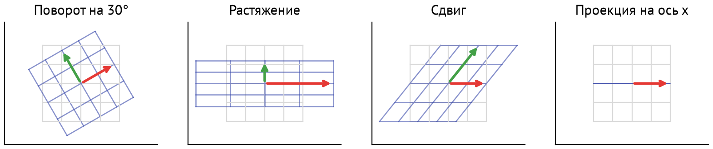
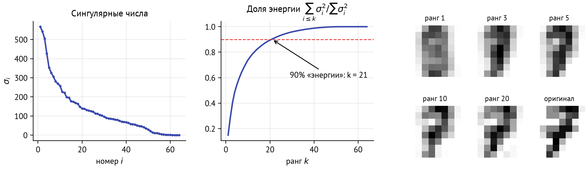
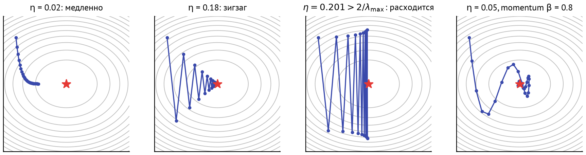
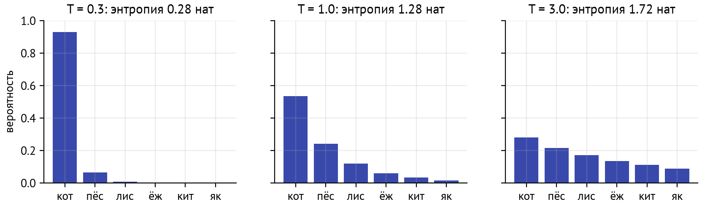
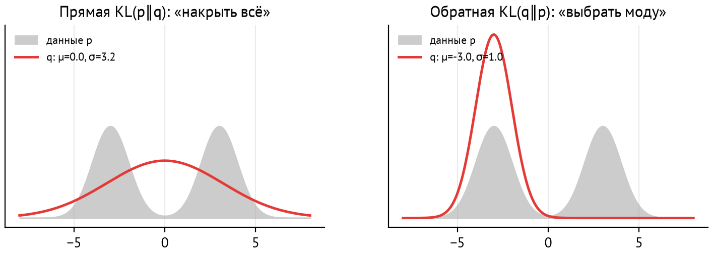

# Зачем этот модуль

Большая языковая модель — это несколько десятков матричных умножений, softmax и функция потерь, которую минимизируют градиентным спуском. Чтобы читать статьи про трансформеры, LoRA и DPO, не спотыкаясь на каждой формуле, нужен небольшой, но плотный набор математики. Этот модуль — именно такой набор, без доказательств ради доказательств. К каждому понятию указано, где оно встретится дальше в курсе.

| Понятие | Где встречается в LLM | Модуль |
|---|---|---|
| Скалярное произведение, косинус | близость эмбеддингов, оценки внимания $QK^\top$ | M06, M11 |
| Матричное умножение | каждый слой модели; стоимость в FLOPs | M06, M08 |
| Проекции | головы внимания, $W_Q, W_K, W_V$ | M06 |
| SVD, низкий ранг | LoRA, сжатие, PCA | M02, M25 |
| Градиент, цепное правило | обратное распространение ошибки | M03, M07 |
| Adam, AdamW, расписание LR | обучение любой LLM | M03, M07 |
| Softmax, температура | внимание, сэмплирование токенов | M06, M08 |
| Кросс-энтропия, перплексия | функция потерь и метрика языковой модели | M06, M07 |
| KL-дивергенция | дистилляция, RLHF, DPO | M07, M25 |

Если вы уверенно отвечаете на вопросы для самопроверки в конце, модуль можно пролистать и сразу решить упражнения.

::: {.callout-note}
## Практика
Уроки: `01-linear-algebra` (векторы, эмбеддинги, SVD, LoRA), `02-gradients` (градиенты и оптимизаторы руками), `03-probability` (softmax, температура, энтропия и перплексия на настоящих вероятностях модели). Упражнения — в `exercises/`.
:::

# Линейная алгебра

## Векторы и скалярное произведение

Вектор $x \in \mathbb{R}^d$ — упорядоченный набор из $d$ чисел. В LLM векторами представлено всё: токен на входе, скрытое состояние после каждого слоя, эмбеддинг документа в RAG. Типичные размерности — от 384 до 8192.

::: {.callout-note}
## Определение
**Скалярное произведение** $x \cdot y = \sum_{i=1}^d x_i y_i = \|x\|\,\|y\|\cos\theta$, где $\|x\| = \sqrt{x \cdot x}$ — длина (евклидова норма), $\theta$ — угол между векторами.

**Косинусная близость** $\cos(x, y) = \dfrac{x \cdot y}{\|x\|\,\|y\|} \in [-1, 1]$.
:::

Скалярное произведение смешивает два эффекта: длину векторов и угол между ними. Косинус оставляет только угол, то есть *направление*. В пространстве эмбеддингов направление кодирует смысл, поэтому близость текстов почти всегда измеряют косинусом.

::: {.callout-tip}
## Интуиция
Представьте эмбеддинг как стрелку. «Кошка спит на подоконнике» и «A cat is sleeping on the windowsill» — стрелки, смотрящие почти в одну сторону: косинус 0,72, хотя языки разные. «Курс доллара вырос на бирже» смотрит в другую сторону: косинус с «кошкой» — 0,39 (урок 1, модель bge-m3). Длина стрелки у многих моделей несёт мало смысла, поэтому её убирают нормализацией.
:::

Если векторы **нормированы** ($\|x\| = \|y\| = 1$), косинус равен скалярному произведению. Многие модели эмбеддингов, включая bge-m3, возвращают уже нормированные векторы. Тогда поиск ближайших соседей среди $N$ документов — одно матричное умножение: $s = E q$, где строки матрицы $E \in \mathbb{R}^{N \times d}$ — эмбеддинги документов, $q$ — эмбеддинг запроса. Векторные базы данных (M11) ускоряют именно эту операцию.

## Матрицы как преобразования

Матрица $A \in \mathbb{R}^{m \times n}$ задаёт линейное отображение $x \mapsto Ax$ из $\mathbb{R}^n$ в $\mathbb{R}^m$. Столбцы $A$ — это то, куда переходят базисные векторы. Поворот, растяжение, сдвиг и проекция — всё это матрицы (рис. [-@fig-transform]).

{#fig-transform}

**Произведение матриц — композиция преобразований:** $(AB)x = A(Bx)$, сначала применяется $B$, потом $A$. Отсюда некоммутативность: повернуть и растянуть — не то же самое, что растянуть и повернуть. Полносвязный слой нейросети $y = Wx + b$ — линейное преобразование плюс сдвиг. Нелинейность между слоями (M03) не даёт цепочке слоёв схлопнуться в одну матрицу.

### Дисциплина размерностей

В коде LLM тензоры почти всегда имеют форму `[batch, seq, d]`: пакет последовательностей, позиция токена, признаки. Линейный слой с матрицей `[d, d_out]` применяется к последней оси: `[B, T, d] @ [d, d_out] → [B, T, d_out]`. Половина ошибок в коде моделей — перепутанные оси, поэтому полезно подписывать формы тензоров в комментариях.

### Сколько стоит умножение

Умножение $A \in \mathbb{R}^{m \times k}$ на $B \in \mathbb{R}^{k \times n}$ требует $m \cdot n \cdot k$ умножений и столько же сложений, то есть $2mnk$ операций с плавающей точкой (FLOPs). Отсюда правило, которое понадобится в M07 и M08: **прямой проход модели с $N$ параметрами стоит около $2N$ FLOPs на токен.** Каждый вес участвует в одном умножении и одном сложении.

## Проекции

Проекция вектора $v$ на направление $u$:
$$
\operatorname{proj}_u v = \frac{v \cdot u}{u \cdot u}\, u.
$$
Остаток $v - \operatorname{proj}_u v$ перпендикулярен $u$. Проекция на подпространство с ортонормированным базисом (столбцы матрицы $Q \in \mathbb{R}^{d \times k}$, $Q^\top Q = I$) равна $QQ^\top v$. Для произвольного базиса $A$ формула сложнее: $A(A^\top A)^{-1}A^\top v$.

Где это в LLM: матрицы $W_Q, W_K, W_V$ каждой головы внимания проецируют скрытое состояние размерности $d$ в подпространство размерности $d_{\text{head}} = d / h$. Каждая голова «смотрит» на свой срез признаков (M06).

## SVD и низкоранговые приближения

::: {.callout-note}
## Определение
**Сингулярное разложение (SVD):** любую матрицу $A \in \mathbb{R}^{m \times n}$ можно записать как
$$
A = U \Sigma V^\top = \sum_{i=1}^{r} \sigma_i\, u_i v_i^\top,
$$
где столбцы $U$ и $V$ ортонормированы, $\sigma_1 \ge \sigma_2 \ge \dots \ge \sigma_r > 0$ — сингулярные числа, $r$ — ранг матрицы.
:::

Геометрически любое линейное преобразование — это поворот ($V^\top$), растяжение по осям ($\Sigma$) и ещё один поворот ($U$). Сумма справа раскладывает матрицу на слагаемые ранга 1, упорядоченные по «важности» $\sigma_i$.

**Теорема Эккарта — Янга.** Лучшее приближение матрицы $A$ матрицей ранга $k$ — это усечённое SVD $A_k = \sum_{i \le k} \sigma_i u_i v_i^\top$. Ошибка приближения:
$$
\|A - A_k\|_F = \sqrt{\sum_{i > k} \sigma_i^2}.
$$
Если сингулярные числа быстро убывают, матрицу можно хранить гораздо компактнее почти без потерь. На рис. [-@fig-svd] — матрица из 1797 рукописных цифр по 64 пикселя: 21 компонента из 64 сохраняет 90% «энергии» $\sum \sigma_i^2$.

{#fig-svd}

### Низкий ранг и LoRA

Матрица $d \times d$ хранит $d^2$ чисел, а произведение $BA$, где $B \in \mathbb{R}^{d \times r}$, $A \in \mathbb{R}^{r \times d}$, — всего $2dr$ и имеет ранг не больше $r$. На этом построен **LoRA** (Low-Rank Adaptation, M25): при дообучении веса $W$ замораживают, а изменение ищут в низкоранговом виде:
$$
W' = W + \frac{\alpha}{r} BA, \qquad B = 0 \text{ в начале обучения}.
$$

::: {.callout-note}
## Пример
В Qwen3-8B скрытая размерность $d = 4096$. Полная матрица $4096 \times 4096$ — это 16,8 млн параметров. LoRA-адаптер ранга $r = 16$ — $2 \cdot 4096 \cdot 16 = 131\,072$ параметра, то есть 0,8%. Эмпирически обновления весов при дообучении действительно близки к низкоранговым, поэтому качество почти не страдает.
:::

SVD лежит и в основе **PCA** (M02): главные компоненты — это правые сингулярные векторы центрированной матрицы данных.

# Анализ и оптимизация

## Градиент

Для функции $f: \mathbb{R}^n \to \mathbb{R}$ **градиент** — вектор частных производных $\nabla f(x) = \left(\frac{\partial f}{\partial x_1}, \dots, \frac{\partial f}{\partial x_n}\right)$. Из разложения Тейлора первого порядка
$$
f(x + \Delta) \approx f(x) + \nabla f(x) \cdot \Delta
$$
следует: при шаге фиксированной длины функция быстрее всего растёт в направлении градиента, а убывает — в противоположном. На этом стоит всё обучение нейросетей: функция потерь зависит от миллиардов параметров, и градиент говорит, как сдвинуть каждый из них, чтобы потери уменьшились.

**Численная проверка.** Производную можно приблизить конечной разностью
$$
f'(x) \approx \frac{f(x+h) - f(x-h)}{2h}
$$
(центральная разность, ошибка $O(h^2)$). Так проверяют аналитические градиенты (*gradient check*). Слишком маленький $h$ не лучше: в арифметике с плавающей точкой разность близких чисел теряет точность. Это видно в уроке 2.

## Цепное правило и обратное распространение

Для композиции $y = f(g(x))$ производная равна $\frac{dy}{dx} = f'(g(x))\, g'(x)$. Для векторных функций производная — матрица Якоби $J$, а цепное правило становится произведением якобианов: $J_{f \circ g}(x) = J_f(g(x))\, J_g(x)$.

Нейросеть — длинная композиция слоёв, в конце которой стоит скалярная функция потерь $L$. **Обратное распространение (backpropagation)** применяет цепное правило с конца: зная $\partial L / \partial y$ для выхода слоя, вычисляет $\partial L / \partial x$ для его входа и $\partial L / \partial W$ для его весов.

::: {.callout-note}
## Пример: линейный слой
Для $y = Wx$ и известного градиента $g = \partial L / \partial y$:
$$
\frac{\partial L}{\partial W} = g\, x^\top, \qquad \frac{\partial L}{\partial x} = W^\top g.
$$
Формы сходятся сами: $g$ имеет размер выхода, $x$ — входа, $W^\top g$ — снова входа.
:::

Главное свойство обратного прохода: градиент по *всем* параметрам вычисляется за время порядка одного-двух прямых проходов, сколько бы параметров ни было. Отсюда оценка из M07: прямой проход стоит $2N$ FLOPs на токен, обратный — около $4N$, обучение — **около $6N$ FLOPs на токен**. Своими руками backprop мы напишем в M03.

## Градиентный спуск

Градиентный спуск (GD) делает шаг против градиента:
$$
\theta_{t+1} = \theta_t - \eta\, \nabla L(\theta_t),
$$
где $\eta$ — **скорость обучения** (learning rate, LR). Поведение GD хорошо видно на квадратичной функции $f(x) = \tfrac12 x^\top A x$ с собственными числами $\lambda_{\min} \le \dots \le \lambda_{\max}$ матрицы $A$:

* спуск сходится, только если $\eta < 2 / \lambda_{\max}$; иначе шаги раскачиваются и уходят в бесконечность;
* скорость сходимости определяет **число обусловленности** $\kappa = \lambda_{\max} / \lambda_{\min}$. Чем сильнее «вытянута» чаша, тем больше зигзагов (рис. [-@fig-gd]).

{#fig-gd}

**Стохастический градиентный спуск (SGD).** Градиент по всем данным дорог, поэтому его оценивают по мини-батчу из $B$ примеров. Оценка несмещённая, а её шум убывает как $1/\sqrt{B}$. Немного шума даже полезно: он помогает выбираться из плохих областей.

## Momentum и Adam

**Momentum** («тяжёлый шар») накапливает скользящую сумму градиентов:
$$
v_{t+1} = \beta v_t + \nabla L(\theta_t), \qquad \theta_{t+1} = \theta_t - \eta\, v_{t+1}.
$$
В направлениях, где градиент всё время одного знака, шаг разгоняется. Там, где знак скачет (зигзаг), колебания гасятся.

**Adam** хранит для каждого параметра две скользящие средние: градиента (первый момент) и его квадрата (второй момент):
$$
\begin{aligned}
m_t &= \beta_1 m_{t-1} + (1 - \beta_1) g_t, &\quad \hat m_t &= m_t / (1 - \beta_1^t),\\
v_t &= \beta_2 v_{t-1} + (1 - \beta_2) g_t^2, &\quad \hat v_t &= v_t / (1 - \beta_2^t),\\
\theta_t &= \theta_{t-1} - \eta\, \frac{\hat m_t}{\sqrt{\hat v_t} + \varepsilon}.
\end{aligned}
$$
Деление на $\sqrt{\hat v_t}$ нормирует шаг: параметры с крупными градиентами двигаются не быстрее остальных, и шаг по каждому параметру имеет масштаб порядка $\eta$. Поправки $1/(1-\beta^t)$ убирают смещение к нулю на первых шагах. Например, на первом шаге $\hat m_1 / \sqrt{\hat v_1} = g_1 / |g_1| = \pm 1$. Стандартные значения: $\beta_1 = 0{,}9$, $\beta_2 = 0{,}999$, $\varepsilon = 10^{-8}$. Для LLM обычно берут $\beta_2 = 0{,}95$: так обучение стабильнее при редких всплесках градиента.

**AdamW.** Регуляризация весов (weight decay) тянет веса к нулю. Если добавить её в функцию потерь как $\lambda\|\theta\|^2$, она пройдёт через нормировку Adam и ослабнет для параметров с большими градиентами. AdamW применяет её отдельно, в обход нормировки:
$$
\theta_t = \theta_{t-1} - \eta \left( \frac{\hat m_t}{\sqrt{\hat v_t} + \varepsilon} + \lambda\, \theta_{t-1} \right).
$$
Почти все современные LLM обучаются AdamW.

## Расписание скорости обучения

LR редко держат постоянной. Стандарт для трансформеров — **линейный прогрев (warmup)** на первых сотнях или тысячах шагов, потом **косинусное затухание**:
$$
\eta_t = \eta_{\min} + \tfrac12 (\eta_{\max} - \eta_{\min}) \left(1 + \cos \frac{\pi t}{T}\right).
$$
Прогрев нужен, потому что в начале обучения оценки моментов Adam ещё шумные и большой шаг может «сломать» модель.

::: {.callout-warning}
## Осторожно
Функция потерь, которая вдруг стала `nan` или взлетела, — почти всегда слишком большой LR, отсутствие прогрева или переполнение в вычислениях. Первое, что стоит сделать, — уменьшить LR в 3–10 раз.
:::

# Вероятность

## Языковая модель — это распределение

Языковая модель задаёт вероятность последовательности токенов через **цепное правило вероятностей**:
$$
p(x_1, \dots, x_T) = \prod_{t=1}^{T} p(x_t \mid x_{<t}).
$$
На каждом шаге модель выдаёт распределение над словарём (у Qwen3 около 152 тысяч токенов) для следующего токена. Генерация — это многократное сэмплирование из таких распределений. Никакой другой «магии» в авторегрессионной генерации нет.

## Байес и максимальное правдоподобие

**Формула Байеса** $p(A \mid B) = \dfrac{p(B \mid A)\, p(A)}{p(B)}$ переворачивает условную вероятность. В курсе она нужна для интуиции: как калибровать классификатор, почему редкий класс трудно ловить даже точной моделью (M02).

**Метод максимального правдоподобия (MLE):** параметры модели выбирают так, чтобы наблюдаемые данные были наиболее вероятны:
$$
\theta^* = \arg\max_\theta \sum_i \log p_\theta(x_i) = \arg\min_\theta \Big( -\sum_i \log p_\theta(x_i) \Big).
$$
Логарифм превращает произведение в сумму и не даёт числам уйти в машинный ноль. Минус превращает максимизацию в минимизацию **отрицательного логарифма правдоподобия** (NLL). Обучение языковой модели — это MLE на корпусе текстов: $L = -\sum_t \log p_\theta(x_t \mid x_{<t})$.

## Softmax

Нейросеть выдаёт произвольные вещественные числа — **логиты** $z \in \mathbb{R}^V$. Softmax превращает их в распределение:
$$
\operatorname{softmax}(z)_i = \frac{e^{z_i}}{\sum_j e^{z_j}}.
$$
Все значения положительны, в сумме дают 1, и порядок сохраняется. Важное свойство: $\operatorname{softmax}(z + c) = \operatorname{softmax}(z)$ для любой константы $c$. Поэтому на практике вычитают максимум: $e^{z_i - \max z}$ не переполняется. Логарифм знаменателя — функция **log-sum-exp**:
$$
\log \operatorname{softmax}(z)_i = z_i - \operatorname{LSE}(z), \qquad \operatorname{LSE}(z) = \max z + \log \sum_j e^{z_j - \max z}.
$$

::: {.callout-warning}
## Осторожно
Наивный `np.exp(z) / np.exp(z).sum()` при логитах порядка 1000 даёт `inf / inf = nan`, а при сильно отрицательных — `0 / 0`. В библиотеках всегда используйте готовые `log_softmax` и `logsumexp`: они устойчивы.
:::

## Температура и сэмплирование

**Температура** $T$ делит логиты перед softmax: $p_i \propto e^{z_i / T}$ (рис. [-@fig-temperature]).

* $T \to 0$ — вся вероятность уходит на самый вероятный токен (жадная генерация, *greedy*);
* $T = 1$ — исходное распределение модели;
* $T \to \infty$ — распределение становится равномерным.

{#fig-temperature}

Кроме температуры, «хвост» маловероятных токенов отсекают фильтрами. После фильтра вероятности нормируют заново:

* **top-k** — оставить $k$ самых вероятных токенов;
* **top-p (nucleus)** — оставить наименьший набор токенов, суммарная вероятность которых не меньше $p$ (например, 0,9);
* **min-p** — оставить токены с вероятностью не меньше $p_{\min} \cdot p_{\max}$.

Подробно стратегии декодирования разбираются в M08.

# Теория информации

## Энтропия

**Энтропия** распределения $p$ — средняя «неожиданность» исхода:
$$
H(p) = -\sum_i p_i \log p_i.
$$
Для детерминированного распределения она равна 0, для равномерного на $n$ исходах — максимальна и равна $\log n$. С натуральным логарифмом энтропия измеряется в *натах*, с двоичным — в *битах* (1 нат = $1/\ln 2 \approx 1{,}44$ бита). Энтропия распределения следующего токена показывает, насколько модель уверена: после «Столица Франции —» она близка к нулю, в начале сказки — велика.

## Кросс-энтропия

**Кросс-энтропия** — средняя неожиданность исходов из $p$, если мы кодируем их, ожидая распределение $q$:
$$
H(p, q) = -\sum_i p_i \log q_i.
$$
Если истинное распределение — «правильный токен $y$ с вероятностью 1», кросс-энтропия превращается в $-\log q_y$. Это ровно NLL из предыдущего раздела. **Функция потерь языковой модели — кросс-энтропия между реальным следующим токеном и предсказанием модели**, усреднённая по всем позициям.

## KL-дивергенция

**Дивергенция Кульбака — Лейблера** измеряет, насколько распределение $q$ отличается от $p$:
$$
\mathrm{KL}(p \,\|\, q) = \sum_i p_i \log \frac{p_i}{q_i} = H(p, q) - H(p) \ge 0.
$$
Она равна нулю только при $p = q$. KL — не расстояние: она несимметрична. Поскольку $H(p)$ от $q$ не зависит, минимизация кросс-энтропии по $q$ — то же самое, что минимизация $\mathrm{KL}(p\,\|\,q)$.

Направление важно (рис. [-@fig-kl]):

* **прямая KL** $\mathrm{KL}(p\,\|\,q)$ сильно штрафует $q$ за ноль там, где $p > 0$. Поэтому $q$ старается «накрыть» все моды данных. Так ведёт себя обычное обучение на данных (MLE);
* **обратная KL** $\mathrm{KL}(q\,\|\,p)$ штрафует $q$ за массу там, где $p \approx 0$. Поэтому $q$ выбирает одну моду и сидит в ней.

{#fig-kl}

::: {.callout-important}
## В продакшне
KL встречается в LLM постоянно. При **дистилляции** маленькую модель учат повторять распределение большой, минимизируя KL между ними. В **RLHF** модель награждают за хорошие ответы, но штрафуют за уход от исходной модели: $r - \beta\, \mathrm{KL}(\pi \,\|\, \pi_{\text{ref}})$. Иначе она находит «дыры» в модели награды. **DPO** выводится из той же постановки (M07).
:::

## Перплексия

**Перплексия** — экспонента средней кросс-энтропии на токен:
$$
\mathrm{PPL} = \exp\Big( -\frac{1}{T} \sum_{t=1}^T \log p(x_t \mid x_{<t}) \Big).
$$
Интерпретация: если модель на каждом шаге равномерно выбирает из $k$ вариантов, её перплексия равна $k$. Перплексия — это «эффективное число вариантов», между которыми модель колеблется. У хорошей модели на обычном тексте она порядка единиц.

::: {.callout-warning}
## Осторожно
Перплексию моделей с **разными токенизаторами** напрямую сравнивать нельзя: у одной модели слово — один токен, у другой — три, и усреднение идёт по разному числу шагов. Корректнее сравнивать суммарную NLL, нормированную на символы или байты текста (bits per byte).
:::

# Связь с кодом

::: {.callout-note}
## Практика → уроки
* **Урок 1** `01-linear-algebra`: косинус и поиск соседей на настоящих эмбеддингах bge-m3, матрицы как преобразования, FLOPs, проекции, SVD на цифрах, экономия параметров LoRA.
* **Урок 2** `02-gradients`: численные производные и gradient check, цепное правило для нейрона вручную, GD на вытянутой чаше, momentum и Adam с нуля.
* **Урок 3** `03-probability`: устойчивый softmax, температура, top-k и top-p на реальном распределении следующего токена от модели курса, KL между двумя моделями, перплексия по `logprobs`.
:::

# Подводные камни

* **Косинус против скалярного произведения.** Для ненормированных векторов результаты разные. Проверьте норму эмбеддингов, прежде чем выбирать метрику в векторной базе.
* **Broadcasting.** NumPy молча «растянет» массив `[n]` до `[n, n]`, если вы перепутали оси. Проверяйте формы (`x.shape`) после каждой операции.
* **Устойчивость.** Экспонента переполняется уже при аргументе около 710 (float64) или 89 (float32), а в float16 — около 11. Считайте в логарифмах: `logsumexp`, `log_softmax`.
* **LR.** Слишком большой шаг приводит к расходимости, слишком маленький — к бесконечному обучению. LR — первый гиперпараметр, который стоит настраивать.
* **Направление KL.** $\mathrm{KL}(p\,\|\,q) \ne \mathrm{KL}(q\,\|\,p)$. В статьях всегда смотрите, какое направление используется.
* **Перплексия разных токенизаторов** несравнима. Сравнивайте NLL на символ или байт.

# Вопросы для самопроверки

1. Эмбеддинги нормированы. Почему косинусная близость тогда совпадает со скалярным произведением и как найти 5 ближайших документов к запросу одной матричной операцией?
2. Сколько FLOPs нужно, чтобы умножить матрицу $4096 \times 4096$ на пакет из 512 векторов? Сколько FLOPs на токен тратит прямой проход модели на 8 млрд параметров?
3. Сколько параметров у LoRA-адаптера ранга 8 для матрицы $4096 \times 1024$? Какую долю это составляет от полной матрицы?
4. Чему равна ошибка $\|A - A_k\|_F$ лучшего приближения ранга $k$, если известны сингулярные числа?
5. Почему центральная разность точнее односторонней и почему нельзя брать $h = 10^{-15}$?
6. Для $y = Wx$ известен $\partial L / \partial y$. Запишите $\partial L / \partial W$ и $\partial L / \partial x$.
7. Собственные числа гессиана квадратичной функции — 1 и 100. При каком LR градиентный спуск разойдётся? Чем поможет Adam?
8. Почему на первом шаге Adam сдвигает каждый параметр ровно на $\eta$ (при $\varepsilon \to 0$)?
9. Чем AdamW отличается от Adam с L2-регуляризацией в функции потерь?
10. Что произойдёт с распределением при температуре 0,1 и 10? Чему равна энтропия равномерного распределения на 4 исходах?
11. Модель предсказала правильному токену вероятность 0,25. Чему равен вклад этой позиции в кросс-энтропию (в натах и битах)? Какая перплексия у модели, которая всегда даёт правильному токену 0,25?
12. Почему минимизация кросс-энтропии эквивалентна минимизации $\mathrm{KL}(p\,\|\,q)$? Какое направление KL «выбирает моду»?

# Ответы

1. $\cos(x,y) = x\cdot y / (\|x\|\|y\|)$, а знаменатель равен 1. Ближайшие документы: $s = Eq$, затем 5 наибольших $s_i$ (`np.argsort(-s)[:5]` или `np.argpartition`).
2. $2 \cdot 4096 \cdot 4096 \cdot 512 \approx 1{,}7 \cdot 10^{10}$ FLOPs. Прямой проход модели — около $2N = 1{,}6 \cdot 10^{10}$ FLOPs на токен.
3. $r(d_{\text{in}} + d_{\text{out}}) = 8 \cdot (4096 + 1024) = 40\,960$ параметров против $4\,194\,304$ — около 1%.
4. $\sqrt{\sum_{i > k} \sigma_i^2}$ (теорема Эккарта — Янга).
5. Ошибка центральной разности $O(h^2)$, односторонней — $O(h)$. При очень малом $h$ разность $f(x+h) - f(x-h)$ вычисляется с огромной относительной погрешностью из-за округления (порядок $\epsilon_{\text{mach}}/h$). Оптимум для float64 — $h \approx 10^{-5}$.
6. $\partial L/\partial W = g\,x^\top$, $\partial L/\partial x = W^\top g$, где $g = \partial L/\partial y$.
7. Не сходится при $\eta \ge 2/100 = 0{,}02$, а при $\eta > 0{,}02$ расходится. Adam нормирует шаг по каждой координате, и разница масштабов (число обусловленности 100) влияет на него гораздо меньше.
8. $m_1 = (1-\beta_1)g_1$, $v_1 = (1-\beta_2)g_1^2$. После поправок $\hat m_1 = g_1$, $\hat v_1 = g_1^2$, шаг равен $\eta \cdot g_1/|g_1| = \pm\eta$.
9. В Adam с L2 градиент регуляризатора $\lambda\theta$ делится на $\sqrt{\hat v}$, и параметры с большими градиентами почти не регуляризуются. AdamW вычитает $\eta\lambda\theta$ напрямую, одинаково для всех параметров.
10. При $T = 0{,}1$ почти вся масса уходит на самый вероятный токен, при $T = 10$ распределение близко к равномерному. $H = \log 4 \approx 1{,}39$ ната $= 2$ бита.
11. $-\ln 0{,}25 \approx 1{,}386$ ната $= 2$ бита. Перплексия $= e^{1{,}386} = 4$: модель будто выбирает из 4 равновероятных вариантов.
12. $\mathrm{KL}(p\,\|\,q) = H(p,q) - H(p)$, а $H(p)$ от $q$ не зависит. Моду выбирает обратная KL — $\mathrm{KL}(q\,\|\,p)$.

# Что почитать

* M. Deisenroth, A. Faisal, C. Ong. [Mathematics for Machine Learning](https://mml-book.github.io/) — бесплатная книга, главы 2–7.
* 3Blue1Brown. [Essence of Linear Algebra](https://www.3blue1brown.com/topics/linear-algebra) и [Neural Networks](https://www.3blue1brown.com/topics/neural-networks) — лучшая визуальная интуиция.
* I. Goodfellow и др. [Deep Learning](https://www.deeplearningbook.org/), главы 2–4 и 8 — линейная алгебра, вероятность, численные методы, оптимизация.
* D. Kingma, J. Ba. [Adam: A Method for Stochastic Optimization](https://arxiv.org/abs/1412.6980); I. Loshchilov, F. Hutter. [Decoupled Weight Decay Regularization](https://arxiv.org/abs/1711.05101) — AdamW.
* E. Hu и др. [LoRA: Low-Rank Adaptation of Large Language Models](https://arxiv.org/abs/2106.09685).
