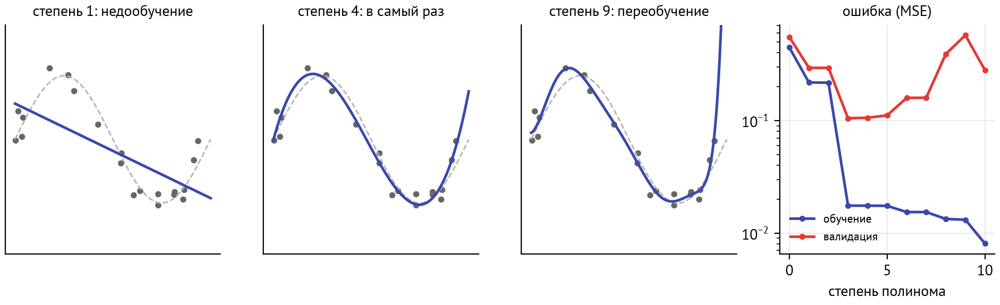
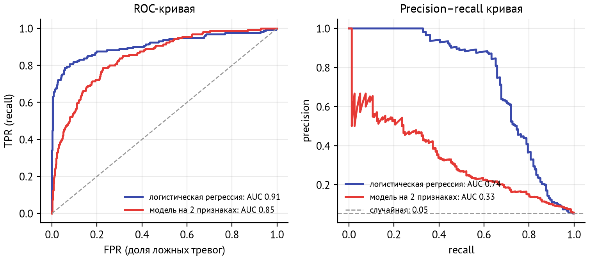
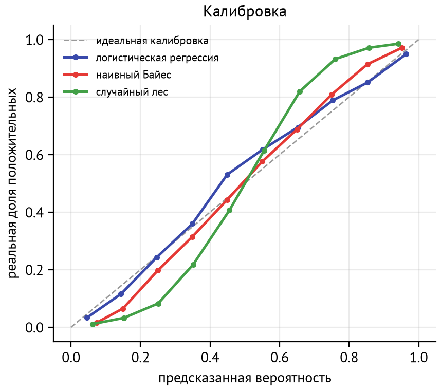
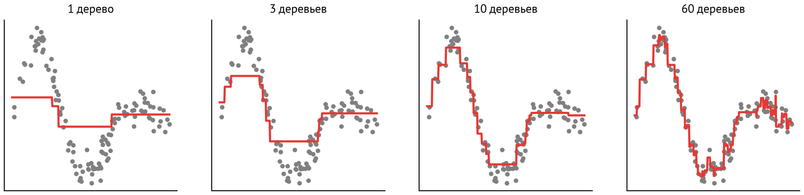
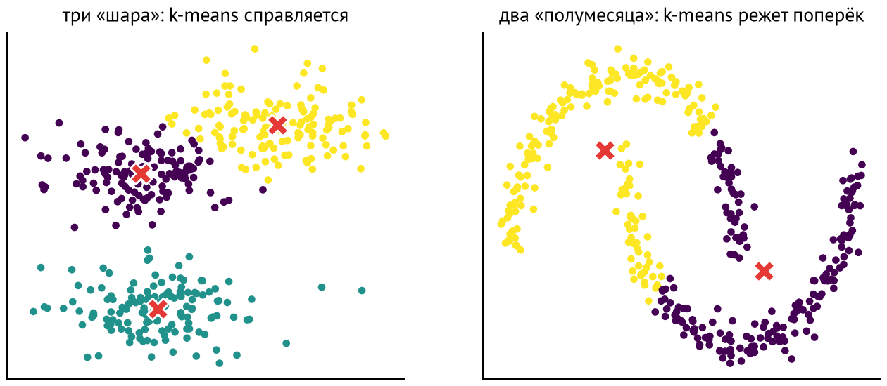

# Зачем этот модуль

LLM не отменили классическое машинное обучение. Они сделали его понятия нужнее. Когда вы проверяете, хорошо ли LLM классифицирует обращения в поддержку, вы считаете precision и recall. Когда роутер решает, отправить запрос в дешёвую или дорогую модель, вы выбираете порог по ROC-кривой. Когда RAG вдруг показывает 95% качества, вы ищете утечку между тестом и индексом. А простую табличную задачу градиентный бустинг решит быстрее, дешевле и точнее любой LLM.

| Понятие | Где понадобится | Модуль |
|---|---|---|
| Валидация и утечки | тестовые наборы для промптов, RAG, агентов | M09, M13, M22 |
| Precision, recall, F1, ROC-AUC | LLM-классификаторы, guardrails, роутеры | M10, M23, M24 |
| Калибровка | уверенность модели, пороги отказа | M22 |
| Логистическая регрессия | линейные «пробы» поверх эмбеддингов | M11 |
| Градиентный бустинг | табличные данные, ранжирование | M12, M24 |
| Кластеризация, PCA, UMAP | анализ эмбеддингов и логов | M11, M23 |

::: {.callout-note}
## Практика
Уроки: `01-validation` (пайплайны, честная валидация, утечки, метрики), `02-linear-models` (линейная и логистическая регрессия с нуля, регуляризация, переобучение), `03-boosting` (деревья, CatBoost, SHAP), `04-unsupervised` (k-means, PCA, UMAP на эмбеддингах отзывов). Упражнения — в `exercises/`.
:::

# Постановка задачи

## Обучение с учителем

Есть объекты $x$ (строка таблицы, текст, картинка) и ответы $y$ (класс, число). Нужно по обучающей выборке $\{(x_i, y_i)\}_{i=1}^n$ найти функцию $f$ из некоторого класса моделей, которая хорошо предсказывает $y$ на **новых** объектах.

::: {.callout-note}
## Определение
**Минимизация эмпирического риска (ERM):** выбрать модель, минимизирующую среднюю функцию потерь на обучающих данных:
$$
\hat f = \arg\min_{f \in \mathcal{F}} \frac1n \sum_{i=1}^n \ell\big(f(x_i), y_i\big).
$$
:::

Нас интересует не ошибка на обучении, а **обобщение** — ошибка на данных, которых модель не видела. Разница между ними — главный источник проблем в ML.

Типы задач: **регрессия** ($y$ — число, потери MSE), **бинарная** и **многоклассовая классификация** ($y$ — класс, потери — кросс-энтропия из M01), **ранжирование** (упорядочить документы по релевантности — вспомним в RAG).

## Переобучение и компромисс смещения и разброса

Слишком простая модель не может уловить закономерность (**недообучение**). Слишком сложная запоминает шум обучающей выборки (**переобучение**). На рис. [-@fig-bv] полином степени 9 проходит почти через все точки, но между ними ведёт себя дико.

{#fig-bv}

Для квадратичных потерь ожидаемая ошибка на новом объекте раскладывается на три слагаемых:
$$
\mathbb{E}\big[(y - \hat f(x))^2\big] = \underbrace{\big(\mathbb{E}\hat f(x) - f^*(x)\big)^2}_{\text{смещение}^2} + \underbrace{\mathbb{D}\,\hat f(x)}_{\text{разброс}} + \underbrace{\sigma^2}_{\text{шум}}.
$$
**Смещение (bias)** — систематическая ошибка: модель в среднем промахивается. **Разброс (variance)** — насколько модель меняется от одной обучающей выборки к другой. Простые модели имеют большое смещение, сложные — большой разброс. Шум неустраним.

Способы бороться с переобучением: больше данных, **регуляризация** (штраф за сложность), ранняя остановка, ансамбли (усреднение уменьшает разброс).

::: {.callout-tip}
## Интуиция
Современные нейросети и LLM имеют миллиарды параметров — «должны» переобучаться, но обобщают. Классическая U-образная кривая здесь дополняется эффектом *double descent*: после порога интерполяции ошибка снова падает. Для классических моделей и умеренных данных U-кривая остаётся хорошим ориентиром.
:::

# Валидация

## Разбиения

* **Отложенная выборка (hold-out):** train / validation / test. На train обучаем, на validation выбираем гиперпараметры, на test один раз оцениваем финальную модель.
* **Кросс-валидация (k-fold):** данные делят на $k$ частей, модель обучают $k$ раз, каждый раз проверяя на другой части. Оценка стабильнее, а её разброс по фолдам показывает, насколько ей верить.
* **Стратификация:** в каждом фолде те же доли классов, что во всей выборке. Обязательна для несбалансированных классов.
* **Групповое разбиение (GroupKFold):** все объекты одной группы (пользователь, документ, пациент) — в одном фолде.
* **Временное разбиение:** обучаемся на прошлом, проверяемся на будущем. Для временных рядов (M05) и для любых данных, где распределение дрейфует.

::: {.callout-warning}
## Осторожно
Если вы сто раз подобрали промпт или гиперпараметры по одной и той же тестовой выборке, она перестала быть тестовой: вы переобучились на неё. Поэтому test трогают один раз, а всё подбирают на validation. В M22 это станет правилом для оценки LLM-приложений.
:::

## Утечки данных

**Утечка (data leakage)** — ситуация, когда при обучении или отборе модели используется информация, недоступная в момент реального предсказания. Модель показывает прекрасное качество на тесте и проваливается в продакшне.

| Утечка | Пример | Как избежать |
|---|---|---|
| Предобработка до разбиения | масштабирование или отбор признаков по всем данным | всё обучаемое — внутри `Pipeline` |
| Целевая утечка | признак «сумма возврата» в задаче «будет ли возврат» | спросить: известен ли признак в момент прогноза? |
| Дубликаты | один отзыв в train и в test | дедупликация до разбиения |
| Группы | фото одного пациента в train и test | `GroupKFold` |
| Время | случайное разбиение временного ряда | разбиение по времени |
| Контаминация | тест-бенчмарк попал в обучающие данные LLM | свои закрытые тестовые наборы |

Последняя строка особенно важна для LLM: публичные бенчмарки давно лежат в интернете и почти наверняка попали в обучающие данные моделей. Поэтому для своей задачи нужен свой тестовый набор (M22).

# Метрики

## Классификация

Для бинарной классификации всё начинается с **матрицы ошибок**: TP (верно найденные положительные), FP (ложные тревоги), FN (пропуски), TN.

* **Accuracy** $= \frac{TP + TN}{n}$ — доля верных ответов. Обманчива при дисбалансе: если мошенничества 1%, модель «никогда не мошенничество» имеет accuracy 99%.
* **Precision** $= \frac{TP}{TP + FP}$ — из тех, кого мы пометили положительными, какая доля действительно такая.
* **Recall** $= \frac{TP}{TP + FN}$ — какую долю положительных мы нашли.
* **F1** $= \frac{2 \cdot P \cdot R}{P + R}$ — гармоническое среднее, штрафует перекос в одну сторону.

Для многих классов метрики считают для каждого класса и усредняют: **macro** — простое среднее по классам (все классы равноправны), **weighted** — с весами по размеру классов, **micro** — по всем объектам сразу.

::: {.callout-note}
## Пример
Guardrail, который блокирует опасные запросы к LLM (M23). Пропустить атаку (FN) дороже, чем лишний раз переспросить пользователя (FP). Значит, важнее recall, и порог выбирают так, чтобы recall был не ниже, скажем, 0,95, а precision — какой получится.
:::

## Пороги, ROC и PR

Большинство моделей выдают не класс, а оценку $s(x)$ — например, вероятность. Класс получается сравнением с порогом $t$. Меняя порог, мы двигаемся между «ловить всех» и «ловить только наверняка».

**ROC-кривая** — зависимость TPR (= recall) от FPR $= \frac{FP}{FP + TN}$ при всех порогах. **ROC-AUC** — площадь под ней. Её смысл: вероятность того, что случайный положительный объект получит оценку выше случайного отрицательного. 0,5 — случайное угадывание, 1 — идеальное ранжирование.

**PR-кривая** — precision от recall. При сильном дисбалансе классов она информативнее ROC. FPR делится на огромное число отрицательных и почти не меняется, а precision чувствует каждую ложную тревогу (рис. [-@fig-roc]).

{#fig-roc}

## Калибровка

Модель **откалибрована**, если среди объектов, которым она дала вероятность 0,8, положительных действительно около 80%. Это отдельное свойство, не то же самое, что качество ранжирования: у модели может быть отличный ROC-AUC и плохая калибровка.

Проверяют калибровку **калибровочной кривой** (reliability diagram, рис. [-@fig-calib]): предсказания разбивают на корзины и сравнивают среднюю предсказанную вероятность с реальной долей положительных. Числовые меры: **Brier score** $\frac1n \sum (p_i - y_i)^2$ и **ECE** — средневзвешенное отклонение корзин от диагонали.

{#fig-calib}

Логистическая регрессия обычно откалибрована хорошо, потому что прямо минимизирует log-loss. Деревья, бустинг и нейросети часто нет. Исправляют это пост-калибровкой на отложенных данных: **Platt scaling** (логистическая регрессия поверх оценок) или **изотоническая регрессия**. У LLM с калибровкой тоже проблемы: модель может быть уверенно неправа. Мы видели это в проекте M01 и вернёмся к этому в M22.

## Регрессия

* **MAE** $= \frac1n\sum|y_i - \hat y_i|$ — средняя абсолютная ошибка, устойчива к выбросам.
* **MSE** и **RMSE** $= \sqrt{\text{MSE}}$ — сильнее штрафуют большие ошибки.
* **$R^2$** $= 1 - \frac{\sum (y_i - \hat y_i)^2}{\sum (y_i - \bar y)^2}$ — доля объяснённой дисперсии: 0 — не лучше среднего, 1 — идеально.

# Линейные модели

## Линейная регрессия

Модель $\hat y = w^\top x + b$ с потерями MSE. У задачи есть решение в явном виде — **нормальное уравнение**:
$$
w^* = (X^\top X)^{-1} X^\top y.
$$
На практике его находят через QR- или SVD-разложение (`np.linalg.lstsq`) или градиентным спуском, если данных очень много. Градиент мы вывели в M01: $\nabla L = \frac2n X^\top(Xw - y)$.

Признаки полезно **масштабировать** (вычесть среднее, поделить на стандартное отклонение). Иначе функция потерь вытянута и градиентный спуск ползёт (число обусловленности из M01), а регуляризация штрафует признаки неравномерно.

## Логистическая регрессия

Для бинарной классификации линейная оценка пропускается через **сигмоиду** $\sigma(z) = \frac{1}{1 + e^{-z}}$, чтобы получить вероятность:
$$
p(y = 1 \mid x) = \sigma(w^\top x + b).
$$
Потери — бинарная кросс-энтропия (log-loss): $\ell = -[y \log p + (1-y)\log(1-p)]$. Это MLE для распределения Бернулли. У неё удивительно простой градиент:
$$
\nabla_w L = \frac1n X^\top (p - y).
$$
Ошибка «предсказание минус ответ», умноженная на признаки — та же форма, что у линейной регрессии. Для многих классов сигмоида заменяется на softmax (M01): получается **мультиномиальная логистическая регрессия**. Это ровно последний слой любой нейросети-классификатора и выходной слой LLM над словарём.

Коэффициенты логистической регрессии интерпретируемы. Увеличение признака $x_j$ на 1 умножает шансы $\frac{p}{1-p}$ на $e^{w_j}$.

## Регуляризация

К потерям добавляют штраф за величину весов:

* **L2 (Ridge):** $\lambda\|w\|_2^2$ — веса уменьшаются равномерно, модель устойчивее к мультиколлинеарности;
* **L1 (Lasso):** $\lambda\|w\|_1$ — многие веса становятся ровно нулём, получается отбор признаков.

В scikit-learn для логистической регрессии силу регуляризации задаёт $C = 1/\lambda$: чем меньше $C$, тем сильнее регуляризация. Лучшее значение подбирают кросс-валидацией.

# Деревья и ансамбли

## Решающее дерево

Дерево последовательно делит пространство признаков вопросами вида «$x_j \le t$?». Каждое разбиение выбирается жадно, так чтобы максимально уменьшить неоднородность (impurity) в дочерних узлах: для классификации — индекс Джини или энтропию, для регрессии — дисперсию. Деревья не требуют масштабирования, естественно работают с нелинейностями и взаимодействиями признаков, но глубокое дерево сильно переобучается.

## Бэггинг и случайный лес

**Бэггинг** обучает много деревьев на бутстреп-выборках и усредняет их предсказания. Усреднение $B$ слабо коррелированных моделей уменьшает разброс. **Случайный лес** дополнительно при каждом разбиении рассматривает случайное подмножество признаков, чтобы деревья меньше походили друг на друга.

## Градиентный бустинг

Бустинг строит ансамбль *последовательно*: каждое новое неглубокое дерево исправляет ошибки уже построенных (рис. [-@fig-boost]).
$$
F_m(x) = F_{m-1}(x) + \eta\, h_m(x), \qquad h_m \approx -\frac{\partial L}{\partial F}\Big|_{F_{m-1}}.
$$
Дерево $h_m$ обучается предсказывать **антиградиент** функции потерь по текущим предсказаниям. Для MSE это просто остатки $y - F_{m-1}(x)$. Отсюда название: это градиентный спуск в пространстве функций. Малый шаг $\eta$ (learning rate) и ранняя остановка по валидации защищают от переобучения.

{#fig-boost}

Библиотеки: **XGBoost**, **LightGBM** (быстрый на больших данных), **CatBoost** (от Яндекса: хорошо работает с категориальными признаками «из коробки» и устойчив к переобучению на настройках по умолчанию). На табличных данных градиентный бустинг — по-прежнему сильнейший метод в большинстве задач, включая соревнования с нейросетями.

::: {.callout-important}
## В продакшне
Прежде чем решать табличную задачу через LLM («вот строка таблицы, предскажи отток»), обучите бустинг. Он работает за миллисекунды, стоит копейки и почти всегда точнее. LLM полезны там, где признаки — это текст. И даже там часто лучше извлечь признаки LLM или эмбеддингами, а решение принять бустингом или логистической регрессией.
:::

## Интерпретация: SHAP

Встроенная «важность признаков» у деревьев (сколько раз признак использовался или сколько уменьшил impurity) смещена в пользу признаков с многими значениями. **SHAP** опирается на значения Шепли из теории игр. Для каждого предсказания он раскладывает отклонение от среднего по признакам:
$$
f(x) = \phi_0 + \sum_{j} \phi_j(x),
$$
где $\phi_j$ — средний вклад признака $j$ по всем порядкам «добавления» признаков. Для деревьев есть быстрый точный алгоритм (TreeSHAP). SHAP отвечает и на глобальный вопрос («какие признаки важны вообще»), и на локальный («почему этому клиенту отказали»).

# Обучение без учителя

## Кластеризация: k-means

**k-means** ищет $k$ центров $\mu_1, \dots, \mu_k$, минимизирующих сумму квадратов расстояний от точек до ближайшего центра:
$$
\min_{\mu, c} \sum_i \|x_i - \mu_{c_i}\|^2.
$$
Алгоритм Ллойда чередует два шага до сходимости: назначить каждую точку ближайшему центру и пересчитать центры как средние своих точек. Результат зависит от начальных центров, поэтому запускают несколько раз (`n_init`) с умной инициализацией k-means++.

Ограничения: число кластеров $k$ задаётся заранее (подбирают по **силуэту** или «локтю»), кластеры предполагаются выпуклыми и похожими по размеру (рис. [-@fig-kmeans]). Для кластеров сложной формы есть DBSCAN, HDBSCAN, спектральная кластеризация.

{#fig-kmeans}

Если истинные метки известны, совпадение кластеров с ними измеряют **ARI** (adjusted Rand index): 0 — случайное совпадение, 1 — полное.

## Понижение размерности

* **PCA** — проекция на направления наибольшей дисперсии. Это правые сингулярные векторы центрированной матрицы данных (SVD из M01). Линейный метод, сохраняет глобальную структуру, быстрый, обратимый.
* **t-SNE** и **UMAP** — нелинейные методы для визуализации. Они стараются сохранить *соседство*: близкие точки остаются близкими. UMAP быстрее и лучше сохраняет крупную структуру.

::: {.callout-warning}
## Осторожно
На картинках t-SNE и UMAP расстояния между кластерами и их размеры почти ничего не значат, и картина меняется от гиперпараметров (`n_neighbors`, `perplexity`). Это инструмент для того, чтобы *посмотреть* на данные и выдвинуть гипотезу. Проверяют гипотезу метриками в исходном пространстве.
:::

Типичное применение в AI-инженерии: посмотреть на эмбеддинги документов для RAG или на логи запросов пользователей, найти кластеры тем, выбросы, дубликаты и «мусор» (в уроке 4 так находятся машинно переведённые отзывы).

# Связь с кодом

::: {.callout-note}
## Практика → уроки
* **Урок 1** `01-validation`: `Pipeline` и `ColumnTransformer` на датасете Adult, кросс-валидация, три вида утечек, матрица ошибок, ROC и PR, выбор порога, калибровка.
* **Урок 2** `02-linear-models`: линейная регрессия (нормальное уравнение и GD), логистическая регрессия с нуля против scikit-learn, L1 и L2, кривая переобучения.
* **Урок 3** `03-boosting`: дерево решений, случайный лес, HistGradientBoosting и CatBoost на Adult, ранняя остановка, SHAP.
* **Урок 4** `04-unsupervised`: эмбеддинги bge-m3 и TF-IDF отзывов RuReviews, PCA, UMAP, k-means, силуэт и ARI, классификатор поверх эмбеддингов.
:::

# Подводные камни

* **Accuracy на несбалансированных данных.** Сначала посчитайте долю самого частого класса: это ваш baseline.
* **Всё обучаемое — внутри пайплайна.** Масштабирование, заполнение пропусков, отбор признаков, TF-IDF — всё это «обучается» и должно видеть только train.
* **Тест — один раз.** Подбор чего угодно по тесту делает оценку оптимистичной.
* **Порог 0,5 не священен.** Выбирайте порог под цену ошибок, на валидации.
* **Хорошее ранжирование ≠ хорошие вероятности.** Если решения принимаются по значению вероятности, проверьте калибровку.
* **Важность признаков ≠ причинность.** SHAP объясняет модель, а не мир.
* **Чувствительные признаки.** В данных о людях (пол, раса, возраст) модель может закрепить дискриминацию. Проверяйте метрики по группам.

# Вопросы для самопроверки

1. Модель показывает 99% accuracy на задаче поиска мошенничества. Какой первый вопрос вы зададите?
2. Вы масштабировали все данные `StandardScaler`, потом сделали кросс-валидацию. Это утечка? А если вместо масштабирования был отбор 20 лучших признаков из 10 000?
3. Чем отличаются precision и recall? Приведите задачу, где важнее precision, и задачу, где важнее recall.
4. ROC-AUC модели 0,9. Что это значит на языке пар объектов?
5. Почему при 1% положительных PR-кривая информативнее ROC?
6. Модель выдаёт вероятность 0,9 для группы объектов, а положительных среди них 60%. Как называется проблема и как её исправить?
7. Как связан градиент логистической регрессии с градиентом линейной? Что общего у логистической регрессии и последнего слоя LLM?
8. Чем L1-регуляризация отличается от L2 по результату?
9. Почему бэггинг уменьшает разброс, а бустинг — смещение?
10. Что обучает каждое новое дерево в градиентном бустинге при MSE?
11. Почему для табличной задачи с 20 числовыми и категориальными признаками не стоит начинать с LLM?
12. На UMAP-картинке два кластера далеко друг от друга. Можно ли сделать вывод, что они сильно различаются?

# Ответы

1. Какой дисбаланс классов? Если мошенничества 1%, константная модель даёт 99%. Смотреть precision, recall, PR-AUC.
2. Масштабирование до разбиения — формально утечка, но обычно слабая. Отбор признаков по всем данным — сильная утечка: на чистом шуме можно получить высокую «точность». Лечится `Pipeline` внутри кросс-валидации.
3. Precision — доля верных среди найденных, recall — доля найденных среди всех верных. Precision важнее для спам-фильтра (нельзя терять нормальные письма), recall — для скрининга болезней или guardrail против атак.
4. Случайно выбранный положительный объект получает оценку выше случайно выбранного отрицательного с вероятностью 0,9.
5. FPR делится на огромное число отрицательных и почти не меняется даже при сотнях ложных тревог. Precision сразу это показывает.
6. Плохая калибровка (излишняя уверенность). Пост-калибровка на отложенных данных: Platt scaling или изотоническая регрессия.
7. Оба имеют вид $\frac1n X^\top(\text{предсказание} - y)$ (с точностью до множителя). Многоклассовая логистическая регрессия — это линейный слой + softmax + кросс-энтропия, как выходной слой LLM над словарём.
8. L1 зануляет часть весов (отбор признаков), L2 равномерно уменьшает все веса.
9. Бэггинг усредняет независимо обученные сложные модели, и их ошибки частично гасят друг друга (разброс падает). Бустинг последовательно добавляет простые модели, исправляющие систематическую ошибку ансамбля (смещение падает).
10. Остатки $y - F_{m-1}(x)$ — антиградиент MSE по предсказаниям.
11. Бустинг будет быстрее на порядки, дешевле, почти наверняка точнее и воспроизводимее. LLM не видит всех данных сразу и плохо работает с числами.
12. Нет. UMAP сохраняет в основном локальное соседство. Расстояния между кластерами на картинке не интерпретируются, проверять нужно в исходном пространстве.

# Что почитать

* [scikit-learn User Guide](https://scikit-learn.org/stable/user_guide.html): разделы Model selection and evaluation, Common pitfalls, Probability calibration.
* T. Hastie, R. Tibshirani, J. Friedman. [The Elements of Statistical Learning](https://hastie.su.domains/ElemStatLearn/) — бесплатная классика, главы 2, 3, 7, 9, 10.
* [Документация CatBoost](https://catboost.ai/docs/) и статья L. Prokhorenkova и др. [CatBoost: unbiased boosting with categorical features](https://arxiv.org/abs/1706.09516).
* S. Lundberg, S.-I. Lee. [A Unified Approach to Interpreting Model Predictions](https://arxiv.org/abs/1705.07874) — SHAP.
* L. McInnes и др. [UMAP](https://umap-learn.readthedocs.io/) — документация с разделом о том, как (не) читать картинки.
* S. Kapoor, A. Narayanan. [Leakage and the Reproducibility Crisis in ML-based Science](https://reproducible.cs.princeton.edu/) — каталог утечек из реальных статей.
