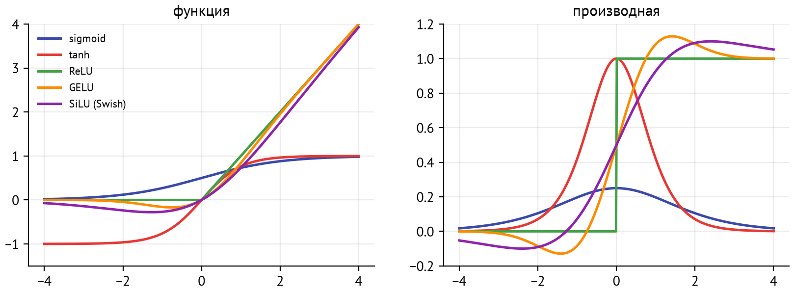
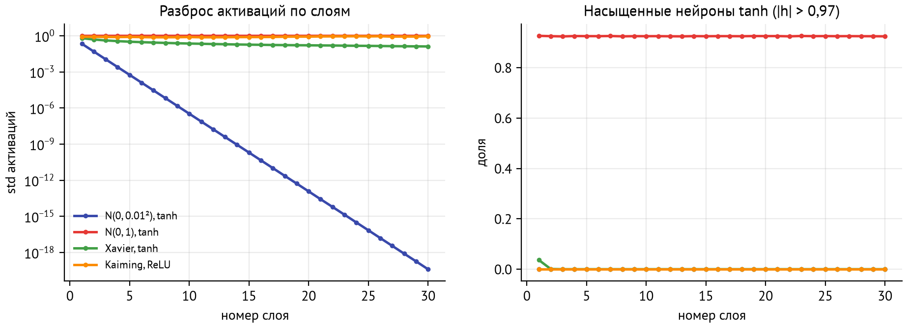
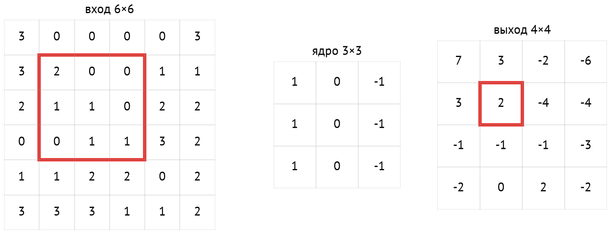
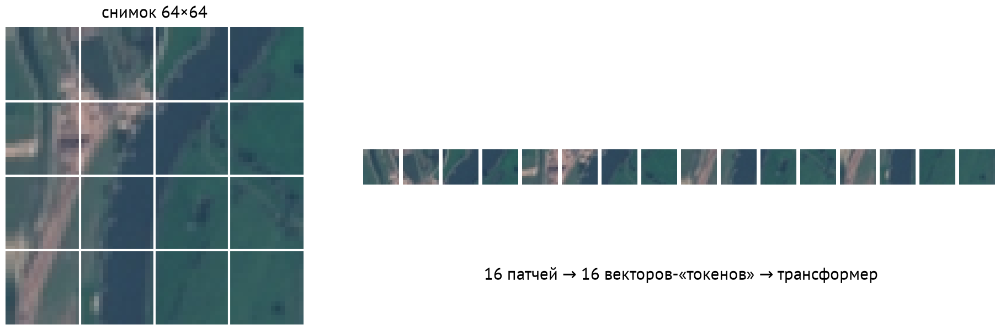
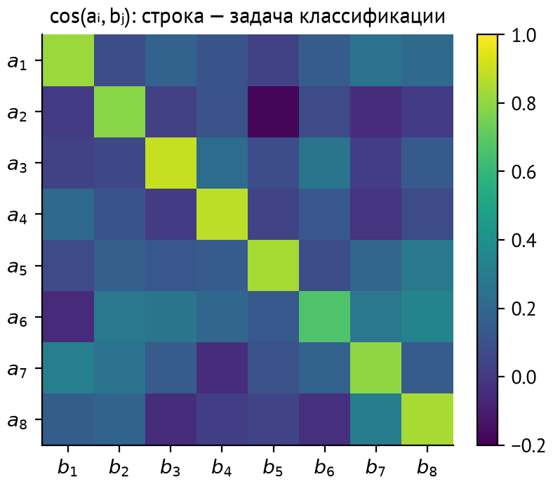

# Зачем этот модуль

LLM — это нейросеть. Слово «трансформер» пугает меньше, если за ним видны знакомые детали: линейные слои, нелинейности, нормализация, остаточные связи, softmax, кросс-энтропия и градиентный спуск. Этот модуль собирает эти детали в одно целое и учит главному инструменту следующих модулей — PyTorch.

Компьютерное зрение здесь — одна глава, и нужна она не ради картинок. Из CV пришли в LLM остаточные связи и transfer learning. Vision Transformer показал, что «токеном» может быть кусок картинки. CLIP дал контрастивное обучение, на котором стоят современные модели эмбеддингов для RAG.

| Понятие | Где понадобится | Модуль |
|---|---|---|
| Autograd, цикл обучения | обучение мини-GPT, fine-tuning | M06, M07, M25 |
| Инициализация, нормализация, residual | устройство трансформера | M06 |
| `nn.Module`, устройства, dtype | загрузка настоящих весов Qwen3 | M06, M08 |
| Transfer learning | дообучение LLM, LoRA | M25 |
| ViT, CLIP | мультимодальные модели | M26 |
| `nn.Embedding`, контрастивное обучение | токены, модели эмбеддингов | M06, M11 |

::: {.callout-note}
## Практика
Уроки: `01-micrograd` (свой autograd на 100 строк), `02-pytorch` (тензоры, `nn.Module`, цикл обучения на MPS, MLP против CNN), `03-vision` (transfer learning и CLIP на спутниковых снимках), `04-embeddings` (`nn.Embedding` и контрастивное обучение текстовых эмбеддингов). Упражнения — в `exercises/`.
:::

# Многослойный перцептрон

## Слой и нелинейность

Полносвязный слой — линейное преобразование со сдвигом, за которым идёт поэлементная **функция активации**:
$$
h = \varphi(Wx + b).
$$
Сеть из нескольких таких слоёв — **многослойный перцептрон (MLP)**. Без $\varphi$ композиция слоёв $W_2(W_1 x) = (W_2 W_1)x$ снова линейна, и глубина ничего не даёт. Нелинейность позволяет сети сгибать пространство. **Теорема об универсальной аппроксимации** говорит, что уже один скрытый слой достаточной ширины приближает любую непрерывную функцию на ограниченной области. На практике глубокие сети добиваются того же гораздо меньшим числом параметров.

{#fig-act}

| Активация | Формула | Где |
|---|---|---|
| sigmoid | $1/(1+e^{-x})$ | выход бинарного классификатора, «ворота» в LSTM |
| tanh | $(e^x - e^{-x})/(e^x + e^{-x})$ | старые RNN |
| ReLU | $\max(0, x)$ | CNN, классика |
| GELU | $x\,\Phi(x)$ | BERT, GPT-2 |
| SiLU / Swish | $x\,\sigma(x)$ | в SwiGLU — MLP-блоки LLaMA и Qwen |

У сигмоиды и tanh производная на краях почти нулевая (рис. [-@fig-act]). Градиент, проходя через много таких слоёв, затухает. ReLU и его гладкие родственники этой проблемы не имеют, поэтому глубокие сети строят на них.

## Выход и функция потерь

Для классификации на $K$ классов последний слой выдаёт $K$ логитов, softmax превращает их в вероятности, а потери — кросс-энтропия (M01). LLM устроена так же, только $K$ — это размер словаря.

::: {.callout-warning}
## Осторожно
`nn.CrossEntropyLoss` в PyTorch принимает **логиты** и сама применяет `log_softmax`. Если подать ей результат `softmax`, softmax применится дважды. Сеть будет учиться, но хуже, и ошибку трудно заметить.
:::

# Обратное распространение и autograd

В M01 мы вручную провели цепное правило для одного нейрона. **Автоматическое дифференцирование** делает то же для любой программы:

1. Во время прямого прохода каждая операция записывается в **вычислительный граф**: какие входы, какой результат, как посчитать локальные производные.
2. `loss.backward()` обходит граф в обратном топологическом порядке. Для каждой вершины градиент по её выходу умножается на локальную производную и **накапливается** в градиентах её входов.

Накопление (`+=`, а не `=`) важно: если значение используется в нескольких местах, градиенты по всем путям складываются. Поэтому в PyTorch градиенты надо обнулять перед каждым шагом (`optimizer.zero_grad()`), иначе они сложатся с градиентами прошлого батча.

::: {.callout-tip}
## Интуиция
Autograd — это бухгалтерия. Прямой проход записывает все операции в журнал. Обратный проход читает журнал с конца и распределяет «вину» за ошибку по всем параметрам. В уроке 1 мы напишем такой журнал сами — класс `Value` на сотню строк, способный обучить маленькую сеть.
:::

# Как обучать глубокие сети

## Инициализация

Если веса слишком малы, сигнал затухает от слоя к слою. Если слишком велики — взрывается или насыщает активации (рис. [-@fig-init]). Правило: дисперсия выхода слоя должна равняться дисперсии входа. Для $h = Wx$ с $n_{\text{in}}$ входами $\operatorname{Var}(h) = n_{\text{in}} \operatorname{Var}(w) \operatorname{Var}(x)$, откуда:

* **Xavier (Glorot)** для tanh и сигмоиды: $\operatorname{Var}(w) = 1/n_{\text{in}}$ или $2/(n_{\text{in}} + n_{\text{out}})$;
* **Kaiming (He)** для ReLU: $\operatorname{Var}(w) = 2/n_{\text{in}}$. Множитель 2 компенсирует то, что ReLU зануляет половину входов.

{#fig-init}

## Нормализация

Нормализующие слои приводят активации к нулевому среднему и единичному разбросу, а потом масштабируют обучаемыми параметрами $\gamma, \beta$:
$$
\hat x = \frac{x - \mu}{\sqrt{\sigma^2 + \varepsilon}}, \qquad y = \gamma \hat x + \beta.
$$
Слои различаются тем, *по чему* считаются $\mu$ и $\sigma$:

* **BatchNorm** — по батчу, для каждого признака отдельно. Стандарт в CNN. Зависит от размера батча и ведёт себя по-разному при обучении и применении.
* **LayerNorm** — по признакам одного примера. Не зависит от батча. Стандарт трансформеров.
* **RMSNorm** — как LayerNorm, но без вычитания среднего: $y = \gamma\, x / \sqrt{\overline{x^2} + \varepsilon}$. Дешевле и работает не хуже. Используется в LLaMA, Qwen и большинстве современных LLM.

## Остаточные связи

**Остаточная связь (residual connection)** добавляет вход блока к его выходу: $y = x + F(x)$. Градиент проходит через сумму без изменений, поэтому даже в сети из сотни блоков он доходит до первых слоёв. Блоку достаточно выучить *поправку* $F(x)$ к тождественному отображению. Остаточные связи появились в ResNet (2015) и стали скелетом трансформера: каждый блок внимания и MLP в LLM обёрнут в residual.

## Регуляризация

* **Weight decay** — AdamW из M01.
* **Dropout** — во время обучения случайно зануляет долю $p$ активаций и масштабирует остальные на $1/(1-p)$. Сеть не может полагаться на отдельные нейроны. При применении модели dropout выключается: для этого есть `model.eval()`.
* **Аугментации** — случайные преобразования входа (повороты, кадрирование, шум, опечатки в тексте), не меняющие ответ.
* **Ранняя остановка** по валидации.

## Точность вычислений

| Формат | Бит | Порядок | Мантисса | Где |
|---|---|---|---|---|
| float32 | 32 | 8 | 23 | по умолчанию |
| float16 | 16 | 5 | 10 | инференс на GPU; при обучении переполняется |
| bfloat16 | 16 | 8 | 7 | обучение LLM: диапазон как у float32 |

Обучение в смешанной точности (mixed precision) хранит копию весов в float32, а считает в 16 битах. Это вдвое экономит память и ускоряет обучение. Квантование весов до 8 и 4 бит — тема M08.

# PyTorch

## Основные понятия

* **Тензор** (`torch.Tensor`) — многомерный массив, как в NumPy, но с устройством (`device`), типом (`dtype`) и возможностью считать градиенты (`requires_grad`).
* **Устройство.** `cpu`, `cuda` (NVIDIA) или `mps` (Apple Silicon). Все тензоры в одной операции должны быть на одном устройстве. В курсе устройство выбирает `mlcourse.get_device()`.
* **`nn.Module`** — модель или её часть. Параметры (`nn.Parameter`) регистрируются автоматически. Метод `forward` описывает вычисление, `model.parameters()` отдаёт всё обучаемое оптимизатору.
* **`Dataset` и `DataLoader`** — источник примеров и нарезка его на перемешанные батчи.

## Цикл обучения

```python
model.train()
for x, y in loader:
    x, y = x.to(device), y.to(device)
    optimizer.zero_grad()      # 1. обнулить старые градиенты
    loss = loss_fn(model(x), y)  # 2. прямой проход
    loss.backward()            # 3. обратный проход
    optimizer.step()           # 4. шаг оптимизатора

model.eval()                   # выключить dropout, BatchNorm — в режим применения
with torch.no_grad():          # не строить граф: быстрее и меньше памяти
    ...
```

Эти несколько строк — одни и те же для MLP на картинках и для LLM на миллиардах токенов. Меняются модель, данные, масштаб и детали: смешанная точность, накопление градиентов, распределённое обучение.

::: {.callout-important}
## В продакшне
Модель сохраняют через `torch.save(model.state_dict(), path)`: это словарь тензоров, а не pickle всей модели. Для публикации весов стандарт — формат **safetensors**: он не может содержать исполняемый код, а pickle может. В M06 мы загрузим веса Qwen3 из safetensors в свою реализацию трансформера.
:::

## PyTorch на Mac

Бэкенд **MPS** (Metal Performance Shaders) ускоряет PyTorch на GPU Apple Silicon. Особенности:

* в Docker MPS недоступен, поэтому уроки с обучением запускаются нативно (`make native`);
* `float64` на MPS не поддерживается, используйте `float32`;
* если операция не реализована для MPS, помогает `PYTORCH_ENABLE_MPS_FALLBACK=1`: она выполнится на CPU;
* маленькие модели иногда быстрее на CPU: копирование данных на GPU и запуск ядер стоят времени. Урок 2 это измеряет.

# Компьютерное зрение одной главой

## Свёртки

Картинка — тензор `[C, H, W]`: каналы (3 для RGB), высота, ширина. Полносвязный слой на картинке 224×224 имел бы миллионы весов на каждый нейрон и не учитывал бы, что соседние пиксели связаны. **Свёрточный слой** решает обе проблемы:

* **локальность** — каждый выход смотрит на небольшое окно входа ($3 \times 3$, $5 \times 5$);
* **общие веса** — одно и то же ядро применяется во всех положениях, поэтому признак «вертикальная граница» ищется по всей картинке.

{#fig-conv}

Размер выхода по каждой оси для входа $n$, ядра $k$, шага $s$ (stride) и дополнения $p$ (padding):
$$
n_{\text{out}} = \left\lfloor \frac{n + 2p - k}{s} \right\rfloor + 1.
$$
У свёрточного слоя $C_{\text{out}}(C_{\text{in}} k^2 + 1)$ параметров, и это число не зависит от размера картинки. **Пулинг** (max или average) уменьшает пространственный размер. Чем глубже слой, тем больше его **рецептивное поле** — область исходной картинки, которую «видит» один нейрон. Первые слои находят края, средние — текстуры и части, последние — объекты.

## Архитектуры

LeNet (1998) → AlexNet (2012, начало эпохи глубокого обучения) → VGG (глубина из маленьких свёрток) → **ResNet** (2015, остаточные связи, 50–150 слоёв) → EfficientNet, ConvNeXt. ResNet-18 с 11,7 млн параметров до сих пор хороший baseline.

## Transfer learning

Сеть, обученная на ImageNet (1,3 млн картинок, 1000 классов), уже умеет выделять общие визуальные признаки. Для новой задачи её не обучают с нуля:

1. **Linear probe** — «заморозить» всю сеть, использовать её как экстрактор признаков и обучить только новый последний слой. Быстро, мало данных, нет риска испортить признаки.
2. **Fine-tuning** — дообучить всю сеть с маленьким LR. Качество выше, но нужно больше данных и вычислений.

Точно так же устроена работа с LLM: предобученная модель + дообучение под задачу (M25). LoRA — компромисс между этими двумя вариантами.

## Vision Transformer

**ViT** (2020) показал, что свёртки не обязательны. Картинка режется на патчи $16 \times 16$. Каждый патч вытягивается в вектор и линейно проецируется — получается последовательность «токенов». Дальше работает обычный трансформер (рис. [-@fig-vit]). На больших данных ViT догоняет и обгоняет CNN. Мультимодальные LLM (M26) видят картинки именно так.

{#fig-vit}

## CLIP: картинки и тексты в одном пространстве

**CLIP** (OpenAI, 2021) состоит из двух кодировщиков: для картинок (ViT или ResNet) и для текстов (трансформер). Их обучали на 400 млн пар «картинка — подпись» из интернета так, чтобы эмбеддинг картинки был близок к эмбеддингу её подписи и далёк от чужих подписей.

**Zero-shot классификация** получается бесплатно: для каждого класса пишем текст «a satellite photo of a forest», считаем эмбеддинги текстов и относим картинку к классу с самым близким текстом. Модель не видела ни одного размеченного примера нашей задачи. В уроке 3 мы сравним этот подход с linear probe и fine-tuning.

# Эмбеддинги как выучиваемые представления

## nn.Embedding

`nn.Embedding(V, d)` — это обучаемая матрица $E \in \mathbb{R}^{V \times d}$ и операция «взять строку по номеру». Выбор строки $i$ — то же, что умножение one-hot вектора $e_i$ на $E$, но без умножения на тысячи нулей. С этого слоя начинается любая LLM: номер токена превращается в вектор размерности $d$ (4096 у Qwen3-8B). Градиент приходит только в строки токенов, которые были в батче.

## Контрастивное обучение

Как научить эмбеддинги отражать смысл, если меток нет? **Контрастивное обучение** строит задачу само. Берутся пары, которые должны быть близки (картинка и её подпись, текст и его перефразировка, два аугментированных варианта одного примера). Остальные примеры в батче служат отрицательными.

::: {.callout-note}
## Определение
**InfoNCE**: для батча из $B$ пар $(a_i, b_i)$ с нормированными эмбеддингами и температурой $\tau$
$$
\mathcal{L} = -\frac{1}{B} \sum_{i=1}^{B} \log \frac{\exp(a_i \cdot b_i / \tau)}{\sum_{j=1}^{B} \exp(a_i \cdot b_j / \tau)}.
$$
:::

Это обычная кросс-энтропия (M01): для каждой строки матрицы сходств $a_i \cdot b_j$ «правильный класс» — диагональный элемент (рис. [-@fig-contrastive]). В коде это одна строка: `F.cross_entropy(A @ B.T / tau, torch.arange(B))`. CLIP применяет её симметрично — по строкам и по столбцам. Температура $\tau \approx 0{,}01$–$0{,}1$ делает распределение острым, чтобы модель различала близкие варианты. Чем больше батч, тем больше отрицательных примеров и тем лучше эмбеддинги.

{#fig-contrastive}

Современные модели текстовых эмбеддингов (bge-m3, E5 — M11) обучаются именно так, на миллионах пар «вопрос — релевантный документ».

# Связь с кодом

::: {.callout-note}
## Практика → уроки
* **Урок 1** `01-micrograd`: класс `Value` с обратным проходом, нейрон и MLP на нём, обучение на «полумесяцах», сверка градиентов с PyTorch.
* **Урок 2** `02-pytorch`: тензоры и autograd, `nn.Module`, Fashion-MNIST: MLP и CNN, MPS против CPU, сохранение модели.
* **Урок 3** `03-vision`: EuroSAT — ResNet-18 как экстрактор признаков, fine-tuning, zero-shot CLIP.
* **Урок 4** `04-embeddings`: `nn.Embedding`, InfoNCE, эмбеддинги отзывов, устойчивые к опечаткам, против TF-IDF.
:::

# Подводные камни

* **Забыли `optimizer.zero_grad()`** — градиенты копятся между батчами.
* **Забыли `model.eval()`** — при применении работают dropout и статистики BatchNorm по батчу.
* **Softmax перед `CrossEntropyLoss`** — двойной softmax.
* **Тензоры на разных устройствах** — `RuntimeError: Expected all tensors to be on the same device`.
* **`float64` на MPS** — не поддерживается. NumPy по умолчанию создаёт float64, поэтому приводите тип: `torch.tensor(x, dtype=torch.float32)`.
* **Утечка через аугментации и нормализацию** — статистики нормализации считаются по train (M02).
* **Сравнение скорости** — первый запуск на MPS включает компиляцию ядер. Измеряйте после прогрева.

# Вопросы для самопроверки

1. Почему MLP без функций активации эквивалентен одному линейному слою?
2. Почему сигмоида плохо подходит для скрытых слоёв глубокой сети?
3. Что делает `loss.backward()` и почему градиенты нужно обнулять перед каждым шагом?
4. Слой 512 → 512 с ReLU. С какой дисперсией инициализировать веса и почему?
5. Чем LayerNorm отличается от BatchNorm и почему в трансформерах используют первый?
6. Зачем остаточные связи? Что они дают градиенту?
7. Вход 32×32, свёртка 5×5 с шагом 1 без паддинга. Какого размера выход? Сколько параметров у свёртки 3 → 16 каналов 5×5?
8. Чем linear probe отличается от fine-tuning? Когда что выбрать?
9. Как CLIP классифицирует картинки, которых не видел при обучении, по классам, которых не было в обучении?
10. Запишите InfoNCE для батча из $B$ пар. Почему это кросс-энтропия? Что даёт увеличение батча?
11. Чем `nn.Embedding` отличается от линейного слоя над one-hot вектором?
12. Почему bfloat16 предпочтительнее float16 для обучения?

# Ответы

1. Композиция линейных отображений линейна: $W_2(W_1x + b_1) + b_2 = (W_2W_1)x + (W_2 b_1 + b_2)$.
2. Производная сигмоиды не больше 0,25 и почти нулевая на краях. При умножении по цепному правилу через много слоёв градиент затухает.
3. Обходит граф вычислений от потерь к параметрам и **прибавляет** градиенты в `.grad`. Без обнуления градиент текущего батча сложится с прошлыми.
4. Kaiming: $\operatorname{Var}(w) = 2/512$, std $\approx 0{,}0625$. Тогда дисперсия активаций сохраняется от слоя к слою: ReLU зануляет половину, множитель 2 это компенсирует.
5. BatchNorm нормирует каждый признак по батчу, LayerNorm — все признаки одного примера. LayerNorm не зависит от размера батча и одинаково работает при обучении и генерации по одному токену.
6. $y = x + F(x)$: градиент по $x$ содержит слагаемое 1 и не затухает в глубокой сети. Блоку достаточно выучить поправку.
7. $32 - 5 + 1 = 28$, выход 28×28. Параметров: $16 \cdot (3 \cdot 5 \cdot 5 + 1) = 1216$.
8. Linear probe обучает только новый последний слой над замороженной сетью: быстро, хватает мало данных. Fine-tuning дообучает всё: точнее, но дороже и рискует переобучиться на маленьких данных.
9. Картинка и тексты с названиями классов кодируются в общее пространство. Выбирается класс, текст которого ближе всего к картинке.
10. $\mathcal{L} = -\frac1B\sum_i \log \operatorname{softmax}_j(a_i \cdot b_j/\tau)_i$ — кросс-энтропия, где «класс» строки $i$ — это $i$. Больше батч — больше отрицательных примеров, задача сложнее, эмбеддинги лучше.
11. Математически это одно и то же ($e_i^\top E$), но embedding просто выбирает строку, не умножая на нули.
12. У bfloat16 8 бит порядка, как у float32, поэтому большие и маленькие значения не переполняются. У float16 5 бит порядка, при обучении нужен масштаб потерь (loss scaling).

# Что почитать

* A. Karpathy. [Neural Networks: Zero to Hero](https://karpathy.ai/zero-to-hero.html) — видеокурс, начинающийся с micrograd.
* [PyTorch: Learn the Basics](https://docs.pytorch.org/tutorials/beginner/basics/intro.html) и [документация MPS-бэкенда](https://docs.pytorch.org/docs/stable/notes/mps.html).
* K. He и др. [Deep Residual Learning for Image Recognition](https://arxiv.org/abs/1512.03385) — ResNet.
* A. Dosovitskiy и др. [An Image is Worth 16x16 Words](https://arxiv.org/abs/2010.11929) — ViT.
* A. Radford и др. [Learning Transferable Visual Models From Natural Language Supervision](https://arxiv.org/abs/2103.00020) — CLIP.
* [Dive into Deep Learning](https://d2l.ai/) — бесплатный учебник с кодом на PyTorch, главы 5–8.
