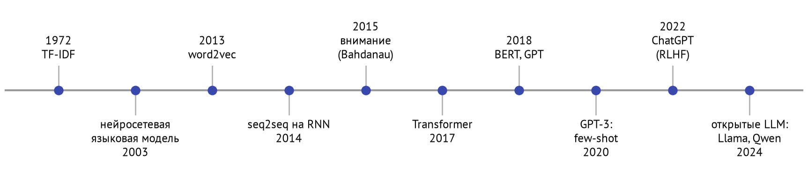
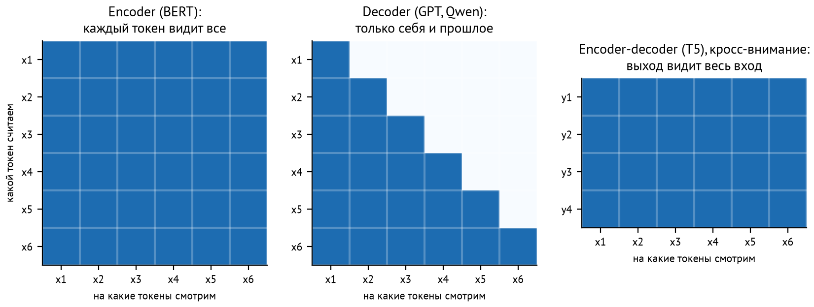
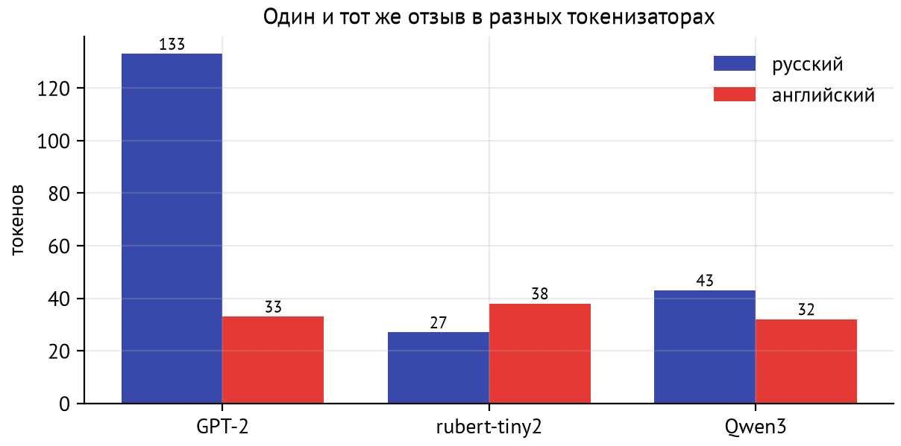

# Зачем этот модуль

Большие языковые модели выросли из обработки естественного языка (natural language processing, NLP) — области, которая полвека училась превращать текст в числа. Модуль короткий. Он отвечает на три вопроса, без которых дальше будет трудно:

1. Как текст превращается в числа — от мешка слов до токенов и контекстных эмбеддингов, и почему это важно для качества и стоимости LLM.
2. Какие бывают трансформеры (encoder, decoder, encoder-decoder) и какая архитектура для какой задачи.
3. Как пользоваться экосистемой Hugging Face и когда вместо промпта для LLM лучше дообучить маленькую модель.

::: {.callout-note}
## Практика
Уроки: `01-baselines` (TF-IDF и логистическая регрессия на отзывах, анализ ошибок), `02-huggingface` (токенизаторы, `pipeline`, `AutoModel`, `datasets`, Hub и лицензии), `03-finetune-vs-llm` (дообучение rubert-tiny2 против zero-shot и few-shot LLM: качество, скорость, стоимость).
:::

# Как текст становился числами

{#fig-timeline}

## Мешок слов и TF-IDF

Самое простое представление текста — **мешок слов** (bag of words): вектор длиной в словарь, где на месте каждого слова стоит число его вхождений. **TF-IDF** взвешивает слова: частые в документе важнее, частые во всём корпусе — менее важны:
$$
\text{tf-idf}(t, d) = \text{tf}(t, d) \cdot \log \frac{N}{\text{df}(t)},
$$
где $\text{tf}(t, d)$ — частота слова $t$ в документе $d$, $N$ — число документов, $\text{df}(t)$ — в скольких документах встречается $t$. Слова «и», «в», «на» получают малый вес, редкие специфичные слова — большой.

Ограничения мешка слов:

* **порядок теряется**: «не понравилось, но вернули деньги» и «понравилось, но не вернули деньги» — один и тот же мешок. Частично помогают **n-граммы** — пары и тройки соседних слов;
* **синонимы не связаны**: «маломерит» и «мал» — разные измерения вектора;
* **морфология**: в русском у слова десятки форм. Помогают лемматизация (привести к начальной форме, например pymorphy3) или **символьные n-граммы**, которые ловят общие корни и устойчивы к опечаткам.

Тем не менее TF-IDF с логистической регрессией — быстрый, прозрачный и сильный baseline. Любое нейросетевое решение стоит сравнивать с ним (урок 1).

## word2vec: смысл из контекста

**Дистрибутивная гипотеза**: слова, встречающиеся в похожих контекстах, похожи по смыслу. word2vec (2013) учит для каждого слова плотный вектор так, чтобы по слову угадывались соседние слова. В варианте skip-gram с отрицательными примерами для пары «слово $w$ — контекст $c$» максимизируется
$$
\log \sigma(u_c \cdot v_w) + \sum_{k} \log \sigma(-u_{c_k} \cdot v_w),
$$
где $c_k$ — случайные слова, не встречавшиеся рядом. Это тот же принцип, что и InfoNCE из M03: сблизить настоящие пары, раздвинуть случайные. В пространстве word2vec появляются знаменитые аналогии: $v_{\text{король}} - v_{\text{мужчина}} + v_{\text{женщина}} \approx v_{\text{королева}}$.

Главное ограничение — **один вектор на слово**. «Замок» на двери и «замок» короля получают одно представление.

## RNN, seq2seq и внимание

**Рекуррентные сети** (RNN, LSTM) читают текст по одному токену, обновляя скрытое состояние $h_t = f(h_{t-1}, x_t)$. Так учитывается порядок. Но обработка последовательная — её нельзя распараллелить по длине, а градиент через сотни шагов затухает.

**Seq2seq** (2014) решал перевод: кодировщик-RNN сжимал фразу в один вектор, декодировщик-RNN разворачивал его в перевод. Один вектор на всё предложение — узкое горлышко. **Внимание** (attention, 2015) убрало его: на каждом шаге декодировщик смотрит на все состояния кодировщика с весами, которые сам же вычисляет. Через два года статья «Attention Is All You Need» убрала и саму рекуррентность — появился **трансформер** (M06).

## Предобучение и контекстные эмбеддинги

В 2018 году сложилась схема, на которой стоят все LLM: **предобучить** большую модель на огромном корпусе неразмеченного текста, а потом **дообучить** или просто **попросить** решить конкретную задачу.

* **BERT** — encoder, обучен восстанавливать замаскированные слова (masked language modeling). Эмбеддинг слова зависит от контекста: «замок» на двери и в сказке получают разные векторы.
* **GPT** — decoder, обучен предсказывать следующий токен (causal language modeling).

Дальше решил масштаб. GPT-3 (2020, 175 млрд параметров) научилась решать задачи по нескольким примерам прямо в промпте (**in-context learning, few-shot**). Дообучение на инструкциях и RLHF (M07) превратило языковую модель в ассистента — ChatGPT (2022).

# Три архитектуры трансформеров

Архитектуры различаются тем, какие токены «видят» друг друга во внимании (рис. [-@fig-masks]).

{#fig-masks}

| Архитектура | Примеры | Обучение | Для чего |
|---|---|---|---|
| **Encoder** | BERT, RoBERTa, rubert-tiny2, bge-m3 | восстановить маску | классификация, NER, эмбеддинги для поиска |
| **Decoder** | GPT, Llama, Qwen, Mistral | следующий токен | генерация и, через промпты, почти всё остальное |
| **Encoder-decoder** | T5, BART, Whisper | вход → выход | перевод, суммаризация, распознавание речи |

Encoder видит текст целиком в обе стороны. Поэтому его представления богаче для **понимания**, но генерировать текст он не умеет. Decoder видит только прошлое и умеет продолжать текст. При большом масштабе он решает и задачи понимания. Сегодня почти все LLM — decoder-only. Encoder-модели живут там, где нужны скорость и дешевизна: классификаторы, модели эмбеддингов для RAG (M11), реранкеры (M13).

# Токенизация

Модель работает не со словами и не с буквами, а с **токенами** — кусками слов из фиксированного словаря.

* Словарь из целых слов огромен и всё равно не покрывает опечатки и новые слова (проблема OOV, out of vocabulary).
* Словарь из символов маленький, но последовательности становятся очень длинными.
* **Подсловные (subword) токены** — компромисс: частые слова — один токен, редкие собираются из кусков.

**BPE** (byte pair encoding) строит словарь жадно. Начинаем с символов и много раз сливаем самую частую пару соседних токенов в новый токен, пока словарь не достигнет нужного размера. **WordPiece** (BERT) и **Unigram/SentencePiece** (T5) — варианты той же идеи. **Byte-level BPE** (GPT-2, Qwen) начинает не с символов, а с 256 байтов UTF-8. Поэтому любой текст, включая эмодзи и код, представим без «неизвестных» токенов.

{#fig-tok}

::: {.callout-important}
## В продакшне
Число токенов — это деньги, скорость и место в контексте. Цена API считается в токенах, время генерации растёт с числом токенов (M00), контекстное окно измеряется в токенах. На рис. [-@fig-tok] один и тот же русский отзыв стоит в GPT-2 в 4 раза больше токенов, чем английский перевод. У Qwen3 разница около трети. Выбирая модель для русского языка, посчитайте токены на своих текстах.
:::

Технические детали, которые встретятся в коде:

* **специальные токены**: `[CLS]` и `[SEP]` у BERT, `<|im_start|>` и `<|im_end|>` в чат-шаблоне Qwen;
* **`max_length` и усечение**: всё, что длиннее, отрезается и модель этого не видит;
* **паддинг и `attention_mask`**: тексты в батче дополняются до одной длины, маска говорит модели, какие позиции — заполнитель;
* **токенизатор и модель — пара**: номера токенов имеют смысл только для той модели, с которой токенизатор обучался.

# Задачи NLP

| Задача | Вход → выход | Классический подход | Метрика |
|---|---|---|---|
| Классификация текста | текст → класс | encoder + линейный слой | accuracy, F1 |
| NER | текст → метки токенов | encoder, token classification | F1 по сущностям |
| Извлечение ответа (QA) | вопрос + текст → фрагмент | encoder, начало и конец фрагмента | exact match, F1 |
| Суммаризация, перевод | текст → текст | encoder-decoder | ROUGE, BLEU, оценка LLM |
| Семантический поиск | текст → вектор | encoder-эмбеддинги | recall@k, nDCG (M11) |
| Генерация, диалог | промпт → текст | decoder | оценка людьми или LLM (M22) |

Сегодня почти любую из этих задач можно решить промптом к LLM. Вопрос в цене: иногда маленькая специализированная модель в сотни раз дешевле и быстрее при том же качестве. Урок 3 это измеряет.

# Экосистема Hugging Face

**Hugging Face Hub** — «GitHub для моделей»: сотни тысяч моделей и датасетов с карточками, версиями и лицензиями. Вокруг него — набор библиотек:

| Библиотека | Что делает | Где в курсе |
|---|---|---|
| `transformers` | модели и токенизаторы: `AutoTokenizer`, `AutoModel…`, `pipeline`, `Trainer` | M04, M06, M08, M25 |
| `tokenizers` | быстрые токенизаторы на Rust | M04, M06 |
| `datasets` | загрузка и обработка датасетов на Apache Arrow: `map`, `filter`, стриминг | M04, M07 |
| `huggingface_hub` | скачивание файлов, информация о моделях, публикация | M04, M08 |
| `accelerate` | обучение на любом железе и нескольких GPU | M07, M25 |
| `peft` | LoRA и другие методы дообучения части параметров | M25 |
| `trl` | SFT, DPO, GRPO — дообучение LLM | M07, M25 |
| `sentence-transformers` | модели эмбеддингов | M11 |

Три уровня работы с моделью:

1. `pipeline("text-classification", model=…)` — одна строка от текста до ответа.
2. `AutoTokenizer` + `AutoModelForSequenceClassification` — контроль над токенизацией, батчами и устройством.
3. `AutoModel` — «голое» тело модели. Скрытые состояния используем сами: для эмбеддингов, своих голов, анализа.

Классы `AutoModelFor…` добавляют к телу голову под задачу. Если голова новая (например, классификатор на 3 класса поверх предобученного rubert-tiny2), её веса инициализируются случайно, и `transformers` об этом предупреждает. Модель нужно дообучить.

::: {.callout-tip}
## Интуиция
Скачанные модели лежат в кэше `~/.cache/huggingface/hub` и не качаются повторно. Для воспроизводимости фиксируйте **ревизию** — хэш коммита в репозитории модели (`revision="…"`). Автор может обновить веса, и ваш результат незаметно изменится.
:::

# Лицензии моделей и данных

«Открытая модель» не значит «можно всё». До того как модель попадёт в продукт, проверьте в карточке три вещи.

1. **Лицензию.** Apache 2.0 и MIT (Qwen, Mistral, bge-m3, rubert-tiny2) разрешают коммерческое использование. Llama Community License разрешает с условиями, например с ограничением по числу пользователей. CC BY-NC запрещает коммерческое использование. OpenRAIL разрешает, но с запретами на отдельные применения.
2. **Данные обучения.** Не попал ли в них ваш тестовый набор? Это **контаминация** из M02. В уроке 2 готовый классификатор тональности показывает на нашем тесте подозрительно высокое качество. Причина — в его карточке: он обучался на том же датасете.
3. **Назначение и ограничения.** На каких языках и доменах модель проверена, какие известные смещения есть.

# Дообучение или промпт

| | Дообучить маленькую модель | Промпт к LLM |
|---|---|---|
| Данные | нужны тысячи размеченных примеров | ноль или несколько примеров |
| Время до первого результата | часы | минуты |
| Качество на узкой задаче | часто выше | зависит от задачи и модели |
| Скорость и цена одного прогноза | миллисекунды, копейки | секунды, токены |
| Смена задачи | переобучать | переписать промпт |
| Приватность | работает у вас | зависит от того, где LLM |

Хорошая стратегия: начать с промпта и получить работающий прототип за день. Собрать с его помощью данные и тестовый набор. Если объём большой или нужна скорость — дообучить маленькую модель, а LLM оставить для сложных случаев (роутинг, M24).

# Связь с кодом

::: {.callout-note}
## Практика → уроки
* **Урок 1** `01-baselines`: TF-IDF по словам, n-граммам и символам, логистическая регрессия на RuReviews, важные слова, анализ ошибок и потолок из-за шума в метках.
* **Урок 2** `02-huggingface`: три токенизатора на одном тексте, `pipeline` и контаминация, `AutoModel` и эмбеддинги, `datasets`, информация о модели с Hub.
* **Урок 3** `03-finetune-vs-llm`: дообучение rubert-tiny2 на 45 тысячах отзывов, zero-shot и few-shot через `local` и `main` со структурированным ответом, сравнение качества, скорости и стоимости.
:::

# Подводные камни

* **Порядок меток.** У готовой модели свой `id2label`: в уроке 2 у классификатора `0 = neutral`, а в датасете `0 = negative`. Сравнивайте метки по названиям, а не по номерам.
* **Усечение.** Длинный отзыв с жалобой в конце после `max_length=128` превращается в положительный.
* **Контаминация.** Прежде чем радоваться качеству готовой модели, проверьте, на чём она обучалась.
* **Токенизатор от другой модели** — бессмысленные номера токенов и мусор на выходе.
* **Сравнение на разных данных.** Модели сравнивают на одном и том же тестовом наборе, лучше — с доверительными интервалами.
* **LLM и формат ответа.** Модель может ответить «Нейтральный.» вместо `neutral`. Структурированный вывод по JSON-схеме снимает проблему (M10).

# Вопросы для самопроверки

1. Почему «не понравилось» и «понравилось» могут получить почти одинаковое представление в мешке слов? Что с этим делают?
2. Чем символьные n-граммы полезны для русских отзывов?
3. Какую задачу решает word2vec и в чём его главное ограничение?
4. Что за «узкое горлышко» было у seq2seq и как его убрало внимание?
5. Чем encoder отличается от decoder? Почему модели эмбеддингов для поиска — обычно encoder?
6. Как BPE строит словарь? Почему у byte-level BPE нет неизвестных токенов?
7. Почему русский текст в GPT-2 занимает в 4 раза больше токенов, чем английский? Чем это плохо?
8. Что делает `attention_mask`?
9. Вы загрузили `AutoModelForSequenceClassification` из базовой модели, и `transformers` предупредил о новых весах `classifier`. Что это значит?
10. Готовая модель показывает 0,9 accuracy на вашем тесте, хотя дообученная вами — 0,76. Что проверить первым?
11. Назовите два аргумента за дообучение маленькой модели и два — за промпт к LLM.

# Ответы

1. В мешке слов «не» и «понравилось» — отдельные измерения без порядка. Помогают n-граммы («не_понравилось»), а надёжнее — модели, учитывающие контекст.
2. Они ловят общие корни у разных форм слова и устойчивы к опечаткам, которых в отзывах много.
3. Учит векторы слов так, чтобы по слову угадывался его контекст. Ограничение — один вектор на слово независимо от контекста.
4. Кодировщик сжимал всё предложение в один вектор. Внимание позволяет декодировщику на каждом шаге смотреть на все состояния кодировщика с вычисляемыми весами.
5. Encoder видит весь текст в обе стороны, decoder — только прошлое. Для эмбеддинга нужен смысл всего текста сразу, поэтому двунаправленный encoder естественнее и дешевле.
6. Начинает с символов (или байтов) и повторно сливает самую частую пару соседних токенов. Byte-level BPE начинает с 256 байтов, из которых собирается любой текст.
7. Словарь GPT-2 строился в основном на английском, и кириллические слова распадаются на байтовые куски. Выше цена и задержка, меньше полезного текста в контексте.
8. Помечает, какие позиции — настоящие токены, а какие — паддинг, чтобы внимание паддинг игнорировало.
9. Голова классификатора новая и инициализирована случайно. Модель нужно дообучить, иначе предсказания случайны.
10. Контаминацию: не обучалась ли модель на этом датасете, проверить её карточку. И совпадает ли соответствие номеров меток.
11. За дообучение: скорость и цена прогноза, качество на узкой задаче, работа без внешнего API. За промпт: не нужны размеченные данные, быстрый старт, легко менять задачу.

# Что почитать

* D. Jurafsky, J. Martin. [Speech and Language Processing](https://web.stanford.edu/~jurafsky/slp3/) — бесплатный учебник, главы про векторную семантику, RNN и трансформеры.
* [Hugging Face LLM Course](https://huggingface.co/learn/llm-course) — главы 1–3: pipeline, токенизаторы, дообучение.
* T. Mikolov и др. [Efficient Estimation of Word Representations in Vector Space](https://arxiv.org/abs/1301.3781) — word2vec.
* J. Devlin и др. [BERT](https://arxiv.org/abs/1810.04805); T. Brown и др. [Language Models are Few-Shot Learners](https://arxiv.org/abs/2005.14165) — GPT-3.
* R. Sennrich и др. [Neural Machine Translation of Rare Words with Subword Units](https://arxiv.org/abs/1508.07909) — BPE для текстов.
* Д. Дале. [Маленький и быстрый BERT для русского языка](https://habr.com/ru/articles/562064/) — о rubert-tiny.
